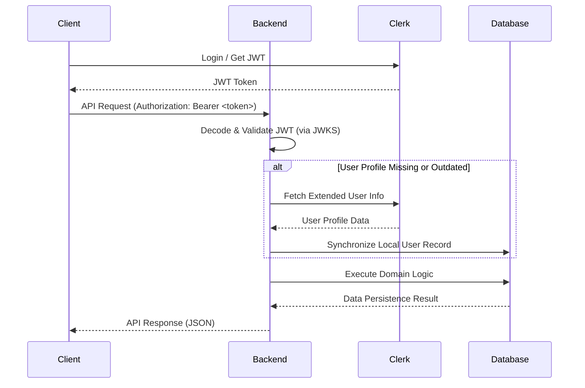
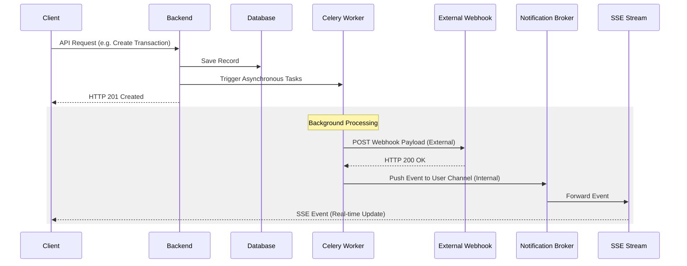

# Power Finance Backend

A robust financial management backend built with Django, utilizing Domain-Driven Design (DDD) principles and Clean Architecture.

## Features

*   **Wallet Management**: Track multiple wallets and their balances with ledger-based integrity.
*   **Transaction Tracking**: Detailed history of income and expenditures using double-entry principles.
*   **Advanced Analytics**: Spending heatmaps, category breakdowns, and money flow analysis.
*   **Webhooks Service**: Resilient event subscription system with token rotation and automated delivery retries.
*   **Real-time Notifications**: Support for REST-based acknowledgments and Server-Sent Events (SSE) streaming.
*   **Advanced Search**: High-performance filtering and search capabilities for all financial records.
*   **Secure Authentication**: Integrated with Clerk for JWT-based authentication and profile synchronization.
*   **Layered Architecture**: Clean separation between Domain, Application, and Infrastructure layers using DDD principles.
*   **Interactive Documentation**: Comprehensive OpenAPI/Swagger UI for rapid API exploration and testing.

---

## Getting Started

### Prerequisites

*   **Python 3.12+**
*   **Docker & Docker Compose**
*   **PostgreSQL** (Managed via Docker)

### Setup Instructions

1.  **Clone the Repository**:
    ```bash
    git clone [repository-url]
    cd power-finance-backend
    ```

2.  **Environment Configuration**:
    Copy `.env.sample` to `.env` and fill in the required values:
    ```bash
    cp .env.sample .env
    ```
    Note: `SECRET_KEY`, `DATABASE_PASSWORD`, and `CLERK_SECRET_KEY` are mandatory configuration items.

3.  **Database Initialization**:
    ```bash
    docker compose up -d
    ```

4.  **Install Dependencies**:
    ```bash
    # It is recommended to use a virtual environment
    python -m venv .venv
    source .venv/bin/activate
    pip install -r requirements.txt
    ```

5.  **Run Migrations**:
    ```bash
    python power_finance/manage.py migrate
    ```

6.  **Start the Development Server**:
    ```bash
    python power_finance/manage.py runserver
    ```

---

## Architecture

The project implements a **Layered Architecture** inspired by Domain-Driven Design (DDD):

*   **Domain Layer**: Contains core business logic, entities (Wallet, Transaction), and domain services.
*   **Application Layer**: Orchestrates domain logic via Commands, Queries, and Use Case services.
*   **Infrastructure Layer**: Handles external concerns such as Database persistence (Django ORM), External integrations (Clerk), and Repository implementations.
*   **Presentation Layer**: Responsible for the HTTP interface, including DRF ViewSets and API routing.

### Current Implementation: HTTP REST API

The backend currently exposes a RESTful API. All API endpoints require a valid Clerk JWT for authentication, excluding standard administrative interfaces and the documentation UI.

#### Interactive API Documentation
The project uses `drf-spectacular` to generate a comprehensive OpenAPI 3.0 schema. You can explore the API using the built-in Swagger UI:

- **Swagger UI**: [http://localhost:8000/api/docs/](http://localhost:8000/api/docs/)
- **Schema (Raw)**: [http://localhost:8000/api/schema/](http://localhost:8000/api/schema/)

#### API Endpoints (v1)

| Category | Endpoint | Method | Description |
| :--- | :--- | :--- | :--- |
| **Wallets** | `/api/v1/wallets/` | `GET`, `POST` | List and create wallets |
| | `/api/v1/wallets/{id}/` | `GET`, `PUT`, `PATCH`, `DELETE` | Manage specific wallet resources |
| | `/api/v1/wallets/search/` | `POST` | Advanced filtering for wallets |
| **Transactions** | `/api/v1/transactions/` | `GET`, `POST` | List and create transaction records |
| | `/api/v1/transactions/{id}/` | `GET`, `PUT`, `PATCH`, `DELETE` | Manage specific transaction resources |
| | `/api/v1/transactions/search/` | `POST` | Advanced filtering for ledger entries |
| **Webhooks** | `/api/v1/webhooks/` | `GET`, `POST` | List and register outgoing webhooks |
| | `/api/v1/webhooks/{id}/` | `GET`, `PUT`, `PATCH`, `DELETE` | Manage webhook settings and rotation |
| **Notifications**| `/api/v1/notifications/` | `GET` | List user notifications |
| | `/api/v1/notifications/ack/`| `POST` | Acknowledge individual or batch notifications |
| **Analytics** | `/api/v1/analytics/categories/` | `GET` | Retrieve spending by category |
| | `/api/v1/analytics/money-flow/` | `GET` | Analyze income vs. expense flow |
| | `/api/v1/analytics/expenditure/` | `GET` | Detailed expenditure breakdown |
| | `/api/v1/analytics/spending-heatmap/` | `GET` | Activity heatmap data retrieval |
| | `/api/v1/analytics/wallet-history/` | `GET` | Historical balance data per wallet |

---

## Authentication and Clerk Integration

Identity management is handled by **Clerk**. Authentication is enforced via JWT Bearer tokens.

### Authentication Flow

1.  **Client** authenticates with Clerk and receives a JWT.
2.  **Client** includes the JWT in the `Authorization: Bearer <token>` header of API requests.
3.  **Backend** validates the JWT signature and expiration using Clerk's JWKS (JSON Web Key Sets).
4.  **Backend** extracts the unique `sub` (External User ID) from the token payload.
5.  **Sync Service** synchronizes the external identity with the local database, ensuring the user profile is up-to-date.



### Asynchronous Event & Notification Delivery Flow

The system uses an event-driven architecture to handle side effects like webhook deliveries and live notifications without blocking the main request-response cycle.



---

## Infrastructure and Observability

The application is fully containerized and includes various background services to ensure system responsiveness:

### Background Processing
- **Celery & RabbitMQ**: Used for asynchronous event handling, such as delivering webhook payloads and processing periodic retries.
- **Redis**: Acts as the Celery result backend and authentication cache for JWT tokens.

### Persistent Logging
Logs are centrally managed and persistent during development across container rebuilds:
- **Location**: All logs are stored in the `logs/` directory in the project root.
- **`debug.log`**: Captures logs from the main HTTP REST application.
- **`celery-debug.log`**: Dedicated log for background worker and beat process activity.

The system uses an intelligent, process-aware routing mechanism to separate logs based on the execution context.

---

## Roadmap and Future Enhancements

*   **WebSockets**: Real-time event streaming for balance updates and transaction notifications initially via SSE, transitioning to full duplex sockets.
*   **Performance Optimization**: Refining authentication caching and N+1 query elimination in analytics.
*   **Advanced Data Visualization**: Integration of client-side visualization tool support for expenditures.
*   **Automated Testing Expansion**: Building a comprehensive integration test suite for asynchronous events.