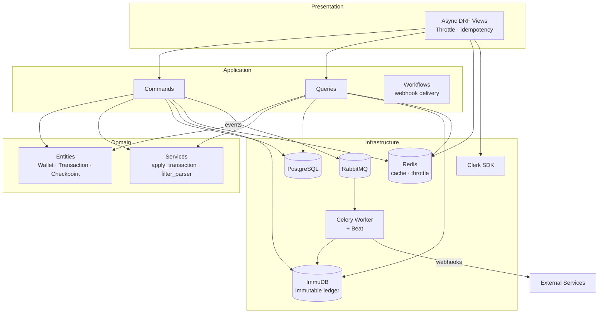
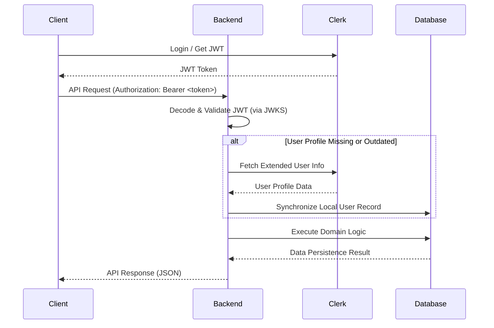
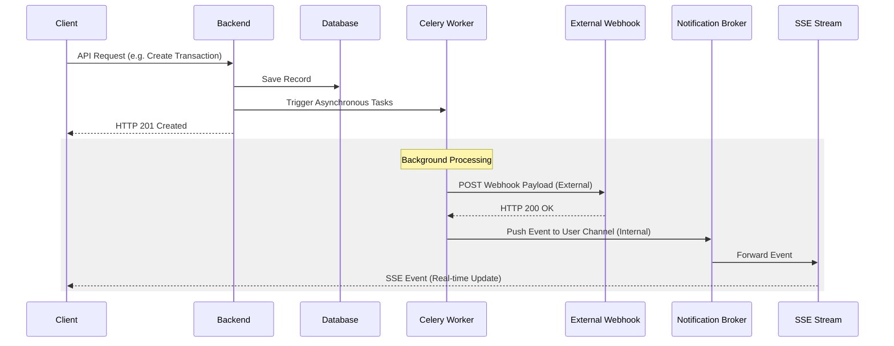
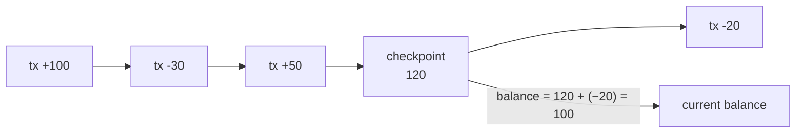

# Power Finance Backend

A robust financial management backend built with Django, utilizing Domain-Driven Design (DDD) principles and Clean Architecture.

## Features

*   **Wallet Management**: Track multiple wallets; balances are derived from an immutable transaction ledger (ImmuDB).
*   **Transaction Tracking**: Double-entry ledger with tamper-evident storage in ImmuDB; periodic balance checkpoints via Celery Beat.
*   **Advanced Analytics**: Spending heatmaps, category breakdowns, and money flow analysis.
*   **Webhooks Service**: Resilient event subscription system with token rotation and automated async delivery retries.
*   **Real-time Notifications**: REST acknowledgment and Server-Sent Events (SSE) streaming.
*   **Advanced Search**: High-performance filtering with a composable filter-tree DSL for all financial records.
*   **Idempotency Keys**: Redis-backed idempotency on all mutating endpoints — safe for client retries.
*   **Rate Limiting**: Redis sliding-window throttle applied per-user across all endpoints.
*   **Async Runtime**: Fully async Django/ASGI stack (Uvicorn + async ORM + httpx).
*   **Secure Authentication**: Clerk JWT with local user-profile sync.
*   **Kubernetes-Ready**: Full k8s manifests — Deployments, PVCs, Services, RBAC, ConfigMap, Secrets, NetworkPolicies.
*   **Layered Architecture**: Domain → Application → Infrastructure → Presentation (DDD/Clean Architecture).

---

## Getting Started

### Prerequisites

*   **Python 3.12+**
*   **Docker & Docker Compose** (local dev) or **Kubernetes** (production)
*   **PostgreSQL**, **Redis**, **RabbitMQ**, **ImmuDB** — all managed via Docker Compose or k8s manifests

### Setup Instructions

1.  **Clone the Repository**:
    ```bash
    git clone [repository-url]
    cd power-finance-backend
    ```

2.  **Environment Configuration**:
    Copy `.env.sample` to `.env` and fill in the required values:
    ```bash
    cp .env.sample .env
    ```
    Note: `SECRET_KEY`, `DATABASE_PASSWORD`, and `CLERK_SECRET_KEY` are mandatory configuration items.

3.  **Database Initialization**:
    ```bash
    docker compose up -d
    ```

4.  **Install Dependencies**:
    ```bash
    # It is recommended to use a virtual environment
    python -m venv .venv
    source .venv/bin/activate
    pip install -r requirements.txt
    ```

5.  **Run Migrations**:
    ```bash
    python power_finance/manage.py migrate
    ```

6.  **Start the Development Server**:
    ```bash
    python power_finance/manage.py runserver
    ```

---

## Architecture

The project implements a **Layered Architecture** inspired by Domain-Driven Design (DDD):

*   **Domain Layer**: Core business logic — entities (`Wallet`, `Transaction`, `BalanceCheckpoint`), domain services, and a composable filter-tree DSL.
*   **Application Layer**: Commands, Queries, and Use Cases; idempotency decorator; async use-case base class.
*   **Infrastructure Layer**: Django ORM (PostgreSQL), ImmuDB client (immutable ledger), Redis (cache/throttle), Celery tasks, Clerk integration, repository implementations.
*   **Presentation Layer**: Async DRF views with Redis-sliding-window throttle and idempotency middleware.

### Component Diagram



### Current Implementation: HTTP REST API

The backend currently exposes a RESTful API. All API endpoints require a valid Clerk JWT for authentication, excluding standard administrative interfaces and the documentation UI.

#### Interactive API Documentation
The project uses `drf-spectacular` to generate a comprehensive OpenAPI 3.0 schema. You can explore the API using the built-in Swagger UI:

- **Swagger UI**: [http://localhost:8000/api/docs/](http://localhost:8000/api/docs/)
- **Schema (Raw)**: [http://localhost:8000/api/schema/](http://localhost:8000/api/schema/)

#### API Endpoints (v1)

| Category | Endpoint | Method | Description |
| :--- | :--- | :--- | :--- |
| **Wallets** | `/api/v1/wallets/` | `GET`, `POST` | List and create wallets |
| | `/api/v1/wallets/{id}/` | `GET`, `PUT`, `PATCH`, `DELETE` | Manage specific wallet resources |
| | `/api/v1/wallets/search/` | `POST` | Advanced filtering for wallets |
| **Transactions** | `/api/v1/transactions/` | `GET`, `POST` | List and create transaction records |
| | `/api/v1/transactions/{id}/` | `GET`, `PUT`, `PATCH`, `DELETE` | Manage specific transaction resources |
| | `/api/v1/transactions/search/` | `POST` | Advanced filtering for ledger entries |
| **Webhooks** | `/api/v1/webhooks/` | `GET`, `POST` | List and register outgoing webhooks |
| | `/api/v1/webhooks/{id}/` | `GET`, `PUT`, `PATCH`, `DELETE` | Manage webhook settings and rotation |
| **Notifications**| `/api/v1/notifications/` | `GET` | List user notifications |
| | `/api/v1/notifications/ack/`| `POST` | Acknowledge individual or batch notifications |
| **Analytics** | `/api/v1/analytics/categories/` | `GET` | Retrieve spending by category |
| | `/api/v1/analytics/money-flow/` | `GET` | Analyze income vs. expense flow |
| | `/api/v1/analytics/expenditure/` | `GET` | Detailed expenditure breakdown |
| | `/api/v1/analytics/spending-heatmap/` | `GET` | Activity heatmap data retrieval |
| | `/api/v1/analytics/wallet-history/` | `GET` | Historical balance data per wallet |

---

## Authentication and Clerk Integration

Identity management is handled by **Clerk**. Authentication is enforced via JWT Bearer tokens.

### Authentication Flow

1.  **Client** authenticates with Clerk and receives a JWT.
2.  **Client** includes the JWT in the `Authorization: Bearer <token>` header of API requests.
3.  **Backend** validates the JWT signature and expiration using Clerk's JWKS (JSON Web Key Sets).
4.  **Backend** extracts the unique `sub` (External User ID) from the token payload.
5.  **Sync Service** synchronizes the external identity with the local database, ensuring the user profile is up-to-date.



### Asynchronous Event & Notification Delivery Flow

The system uses an event-driven architecture to handle side effects like webhook deliveries and live notifications without blocking the main request-response cycle.



---

## Infrastructure and Observability

The application is fully containerized. Both Docker Compose (local dev) and Kubernetes manifests (`deploy/kubernetes/`) are provided.

### Background Processing
- **Celery & RabbitMQ**: Async event handling — webhook delivery, delivery retries.
- **Celery Beat**: Periodic balance-checkpoint task writes a `BalanceCheckpoint` to ImmuDB, keeping read-model balance queries O(1) instead of full ledger replay.
- **Redis**: Celery result backend, JWT auth cache, and sliding-window rate-limit counters.

### Immutable Transaction Ledger (ImmuDB)
Transactions are appended to ImmuDB — a tamper-evident, cryptographically verified ledger. Wallet balance is **derived state**: `balance = latest_checkpoint.amount + sum(transactions since checkpoint)`. This makes balance history auditable without separate audit-log infrastructure.



### Kubernetes Deployment
Full manifests in `deploy/kubernetes/`:

| Resource | Description |
|---|---|
| Deployments | `django`, `celery-worker`, `postgres`, `redis`, `rabbitmq` |
| Services | LoadBalancer (django), ClusterIP (postgres, redis, rabbitmq) |
| PVCs | Persistent volumes for postgres, redis, rabbitmq |
| RBAC | Least-privilege ServiceAccounts for django and celery-worker |
| NetworkPolicies | ImmuDB isolated — only reachable from django + celery |
| ConfigMap / Secrets | Env config and credentials separate from images |

### Persistent Logging
- **`logs/debug.log`**: Main HTTP application.
- **`logs/celery-debug.log`**: Worker and beat activity.

Process-aware routing separates logs by execution context across container rebuilds.

---

## Roadmap and Future Enhancements

*   **Subscriptions & Dunning**: State-machine-driven subscription billing with Celery Beat retry logic.
*   **Money Transfers**: Atomic cross-wallet transfers with deadlock-safe locking.
*   **OpenTelemetry**: Distributed tracing for all k8s services.
*   **Cursor Pagination**: Keyset-based pagination for high-volume transaction lists.
*   **Audit Log**: Structured event sourcing on top of the existing ImmuDB ledger.