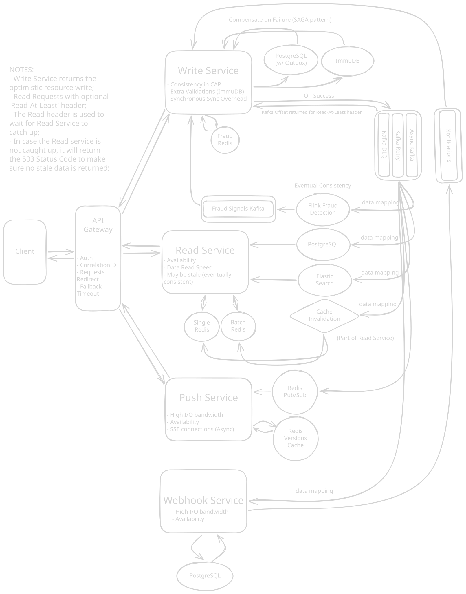

# Power Finance

> A learning-grade fintech backend built on **CQRS** — a consistency-oriented
> write side and an availability-oriented read side, bridged by a Kafka
> transactional outbox, with explicit read-your-writes, real-time SSE, signed
> webhooks, and a two-tier fraud path.

<p align="center">
  
</p>

<p align="center">
  
  
  
  
  
  
</p>

---

## Highlights

- **CQRS split** — a synchronous, consistency-first write side (CAP: C) and an
  eventually-consistent, availability-first read side (CAP: A), never sharing a
  database.
- **Transactional outbox → Kafka** — the write side commits domain changes and
  outbox rows atomically; Debezium ships them to `events.async` keyed per user.
- **Read-your-writes, opt-in** — clients pass a `Read-At-Least` header (a Postgres
  outbox seq); a lagging read model returns `507` and the gateway transparently
  falls back to the write side's consistent endpoints.
- **Real-time** — the push service fans `events.async` out to clients over SSE,
  authenticated per-user at the gateway.
- **Webhooks** — durable, signed (HMAC) delivery with retries, a retry topic, and
  a DLQ; schema owned by Goose migrations.
- **Immutable audit** — writes mirror to ImmuDB with SAGA compensation against
  Postgres.
- **Gateway** — Kong with in-tree Lua plugins: Clerk JWT auth, the Read-At-Least
  sign/verify pair, read-fallback, and two-tier (IP + per-user) rate limiting.
- **Fraud (planned)** — a deep-path fraud service on Java/Apache Flink
  ([ADR-0001](docs/adr-0001-fraud-service.md)).

## Services

| Service | Stack | Role |
| --- | --- | --- |
| **write-service** | Python · Django | Commands → Postgres + outbox, ImmuDB mirror, idempotency, inbound-notifications consumer |
| **read-service** | Python · Django | Projects `events.async` into Postgres + Elasticsearch read models; Redis caches; RAL |
| **push-service** | Go | SSE fan-out of `events.async`, per-user gateway auth, Prometheus metrics |
| **webhook-service** | Go | Signed webhook delivery with retry/DLQ; serves its own delivery log; owns its Postgres; Goose migrations |
| **ai-service** | Python · FastAPI | Derives the double-entry postings behind each transaction; owns its Postgres (SQLAlchemy + Alembic); assistant surface |

Shared code lives in `libraries/` (Python: `correlation-py`, `kafka-client-py`,
`read-at-least-py`, `saga-pattern-py`, `filter-grammar-py`, `webhook-catalog-py`,
`kafka-messages-proto`; Go: `kafka-client-go`). Infrastructure (Kafka, Kong, Postgres, Debezium) is in
`infrastructure/`.

## Quick start

```bash
make install            # sync the uv workspace + wire the git pre-commit hook
docker compose up -d    # gateway + all services + Kafka/Postgres/Redis
make test-datastores    # throwaway Postgres for the Python suites (5533/5534/5536)
make test               # run every service + library suite
```

`make test-datastores` is separate from the stack on purpose. The Python suites
default to 5533/5534/5536 rather than the stack's 5433/5434/5436, because those
belong to the **dev host** whenever `make sandbox-tunnels` is running — and a test
run that reaches one of them creates and drops its test database on the machine
everyone shares. The throwaway instances are tmpfs-backed and safe to leave up;
`make test-datastores-down` discards them.

The gateway proxy is published on `localhost:${GATEWAY_PROXY_PORT:-8080}`. Each
service stack is also standalone-runnable from its own directory
(`docker compose up` under `services/<name>/`).

That runs the **whole stack on this machine** — about 30 containers. If you are
joining a team that already has a shared dev host, you do not need it: go to
[Developer setup](#developer-setup-shared-dev-host) instead and run only the service
you are changing.

## Developer setup (shared dev host)

Start here if someone has given you access to a shared dev host. You clone and edit
locally and run only the service you are changing; the host supplies Kafka, Postgres,
Elasticsearch, Redis, ImmuDB, the gateway and every other service.

What you install: **uv** and Python, plus Go or a JDK only if you are changing those
services. No Docker, no local databases.

You will need from whoever runs the host: its **tailnet name**, your **account name**
on it, the **repo path** there, and the **database / ImmuDB / Elasticsearch
passwords**.

### 1. Join the tailnet

```bash
brew install --cask tailscale && sudo tailscale up
tailscale status | grep <dev-host>          # the host should appear
```

### 2. Set up SSH

Your account on the host is probably not your laptop account, and ssh defaults to the
laptop one. Record it once:

```bash
cat >> ~/.ssh/config <<'EOF'
Host <dev-host>
  User <your account on the host>
  ForwardAgent yes
EOF

ssh <dev-host> 'echo ok'
```

If you get `tailnet policy does not permit you to SSH as user …`, that is usually the
wrong username rather than an ACL problem — see
[infrastructure/dev-host/README.md](infrastructure/dev-host/README.md).

### 3. Clone and install

```bash
git clone git@github.com:isoldpower/power-finance-backend.git
cd power-finance-backend
make install
```

### 4. Write your `.env`

```bash
cp .env.local.example .env
```

Fill in the passwords you were given — they must match the host exactly. Everything
else in that file is optional and already correct.

Do **not** add `ELASTICSEARCH_HOSTS`, `KAFKA_EXTERNAL_HOST`, any `*BIND_ADDRESS`,
`CLERK_ISSUER_URL` or `READ_AT_LEAST_HMAC_SECRET`. Those are host-side settings; the
host's value for the first one (`https://es01:9200`) is a Docker-internal name that
will not resolve on your machine.

### 5. Choose a sandbox name

One fixed word, yours, used identically everywhere — `anna`, `nikita`, `payments-fix`.
**Do not use `$USER`**: it differs between your laptop and the host, and a mismatch
fails silently (your request quietly runs against `main`).

### 6. Open the tunnels — leave this running

```bash
make sandbox-tunnels DEV_HOST=<dev-host>
```

This forwards the host's Kafka, databases, Redis, ImmuDB, Elasticsearch, OTLP and the
Jaeger UI onto your own `localhost`, and forwards port 8100 back so the gateway can
reach your service. Nothing on the host is published for this; it all rides SSH.

If the binds fail with *"Address already in use"*, something local holds those ports —
most often a baseline stack you started yourself. You do not need one: `make baseline-down`.

### 7. Run the service you are changing

In a second terminal:

```bash
make sandbox-env NAME=<your-sandbox-name> SERVICE=write-service DEV_HOST=localhost
set -a; . .sandbox/<your-sandbox-name>-write-service.env; set +a

cd services/write-service
uv run uvicorn write_service.asgi:application --port 8100 --reload
```

`DEV_HOST=localhost` is right: the endpoints are your tunnel's near end.

### 8. Test it directly — this covers most work

```bash
curl -s -X POST localhost:8100/api/v1/wallets \
  -H "X-User-Id: <a clerk user id>" -H 'Content-Type: application/json' \
  -d '{"name":"Hello","currency":"USD"}'
```

`X-User-Id` is what the gateway would have injected after verifying a token, so this
skips auth and exercises everything else. Edit a file, save, and uvicorn reloads in
about a second — the ordinary loop.

### 9. Test through the gateway, when you need the edge

Only for Clerk auth, rate limits, read-fallback and read-your-writes. Routes live in
the baseline's Redis, so registration happens **on the host** — one ssh hop, made for
you:

```bash
make sandbox-route-remote NAME=<your-sandbox-name> SERVICE=write-service \
    DEV_HOST=<dev-host>
```

```bash
curl -H "Authorization: Bearer <clerk session token>" \
     -H "X-Sandbox: <your-sandbox-name>" \
     http://<dev-host>:8080/api/v1/wallets
```

Requests without `X-Sandbox` go to the baseline, so you never disturb anyone else.

**Mind the method.** The gateway sends `GET /api/v1/*` to read-service and
`POST/PUT/PATCH/DELETE` to write-service. A GET will not reach a write-service
sandbox — it finds no read-service route for your name and falls back to the
baseline, which looks like your sandbox was ignored. Register a route per service you
run locally.

### 10. Finish up

```bash
ssh <dev-host> 'cd <repo path on host> && make sandbox-down NAME=<your-sandbox-name>'
```

Then stop your service and the tunnel. Routes also expire on their own after a week.

### When something looks wrong

| Symptom | Cause |
| --- | --- |
| `tailnet policy does not permit you to SSH as user …` | wrong username — set `User` in `~/.ssh/config` |
| `Address already in use` on every tunnel port | a local stack holds them — `make baseline-down` |
| `500` on your first request | a password in `.env` does not match the host's; check Postgres and ImmuDB |
| `identity provider is unreachable` | host-side `CLERK_ISSUER_URL`; not your problem to fix |
| `User is not yet provisioned in the read store` | that Clerk user has never been written; do one write **without** `X-Sandbox` first |
| `X-Sandbox` seems ignored | the name does not match the registered route, so it fell back to the baseline — `make sandbox-list` on the host |
| a log count is always `0` | Python logs to stderr: `docker logs … 2>&1 \| grep -c …` |

Your sandboxed writes are deliberately invisible to the baseline's read model — its
consumer skips them. If you need your own projections too, ask for
`make sandbox-up NAME=<your-sandbox-name> SERVICE=read-write-consumer` on the host.

## Repository layout

- `services/` — `write-service`, `read-service` (Python/Django), `ai-service`
  (Python/FastAPI) — all uv workspace members — plus `push-service`,
  `webhook-service` (Go, `go mod`) and `antifraud-service` (Java/Flink). Each
  has its own README.
- `libraries/` — shared Python libs and the Go `kafka-client-go`. Tracing,
  context propagation and sandbox routing live in `observability-py`, which owns
  every OpenTelemetry import in the workspace; `correlation-py` is a Django-facing
  layer over it.
- `infrastructure/` — Kafka, Kong gateway, Postgres, Debezium —
  [infrastructure/README.md](infrastructure/README.md). Its `tests/contract/`
  is the cross-service contract suite: the conventions and the published
  surface, checked against `API_TARGET.md`, `API_DIFF.md` and the gateway
  config. Needs no infrastructure to run; see its
  [README](infrastructure/tests/contract/README.md).
- `docs/` — the [architecture spec](docs/architecture.md), ADRs, and diagrams.
- `old-structure/` — the pre-CQRS monolith, kept for reference only and excluded
  from all tooling.

## Make

`make help` lists targets; all assume the workspace root as the working
directory.

- **Per-service routing:** `make <service> <subcommand> [args]` is rewritten to
  `make -C services/<service>-service <subcommand>` (e.g. `make write up`,
  `make read test`, `make webhook migrate`). `make <service>` with no subcommand
  falls into that service's default goal. Router targets are `write`, `read`,
  `push`, `webhook`, `antifraud`, `ai`; root targets (`help`, `test`, `lint`, …) are only defined
  when not routing, so a service subcommand sharing a name doesn't collide. Use
  `make help`, not `make write help`, for the root.
- **Setup / quality:** `make install` (sync the uv workspace + wire the hook),
  `make test-datastores` (the Postgres instances the Python suites expect),
  `make test`, `make lint` / `lint-fix`, `make format` / `format-check`,
  `make typecheck`, `make precommit`.
- The git pre-commit hook is auto-installed on every Makefile invocation: every
  real target order-only-depends on `.git/hooks/pre-commit`. `VIRTUAL_ENV` is
  unexported so a stale value from a shell/hook doesn't shadow `./.venv` for `uv`.

## Docker

The root `compose.yaml` wires the Kong API gateway in front of the workspace and
`include:`s each `services/<name>/compose.yaml`, so per-service stacks stay
standalone-runnable while the root pulls them in. The shared Kafka broker
(`infrastructure/kafka/compose.yaml`) reaches the project transitively through
those includes.

Gateway specifics (plugins, rate-limit tiers, the Read-At-Least mechanism) are in
[infrastructure/README.md](infrastructure/README.md). At the compose level:

- SSE-friendly proxy defaults (buffering off, 1-hour read/send timeouts).
- `KONG_PLUGINS` enables the in-tree plugins; `CLERK_ISSUER_URL` is surfaced into
  Kong's env vault as `{vault://env/clerk-issuer-url}`.
- `READ_AT_LEAST_HMAC_SECRET` must be identical for the `read-at-least` and
  `write-ral-version` plugins so signatures produced on write responses verify on
  read requests; it is not shared with upstream services.
- `gateway-redis` backs Kong's rate-limit counters (keeping the gateway
  stateless); persistence is intentionally off — the counters are ephemeral.

## Shared dev environment

One dev host runs a single **baseline** stack; each developer gets a **sandbox**
holding only the service they are changing. The full stack is ~12–13 GB untuned on
a 16 GB box, so a stack per developer does not fit — the reasoning is in
[ADR-0002](docs/adr-0002-shared-dev-environment.md).

### Baseline

The first `baseline-up` on a fresh host builds every image (10–20 minutes); after
that it starts in under a minute. Images are local-only tags, so each service built
from source sets `pull_policy: build` — Compose would otherwise try a registry pull
first and log `pull access denied` for each one before building anyway.

```bash
make baseline-up        # pf-baseline: everything at main, tuned, Kibana off, Jaeger on
make baseline-logs
make baseline-kibana    # Kibana is scaled to 0 by default; ~768 MB when you want it
make baseline-down
```

`compose.baseline.yaml` layers over `compose.yaml`: memory limits per container,
capped ES and Kafka heaps, one Flink task slot, `OTEL_*` pointed at Jaeger, and
`SANDBOX_ID` explicitly empty, which is what makes the baseline the owner of all
untagged traffic.

### Sandboxes

**What you install locally:** `uv` and Python for the Python services, plus Go or a
JDK only if you are changing those. No Docker, no local Kafka or Postgres.

You clone the repo **on your laptop**, edit it there, and run the service you are
changing there too — the ordinary clone-edit-run loop, with your own debugger and
test runner. Only the heavy dependencies stay on the dev host: Kafka, Postgres,
Elasticsearch, Redis, ImmuDB, the gateway and every service you are *not* changing.

Reach them over SSH tunnels, so nothing on the host has to be published beyond the
gateway:

```bash
make sandbox-tunnels DEV_HOST=pf-dev-host          # leave running; Ctrl-C closes
```

Add `DEV_HOST_USER=<host account>` if your account there differs from your laptop's
— or put `User <host account>` under `Host pf-dev-host` in `~/.ssh/config` once.

Then, in another shell:

```bash
make sandbox-env NAME=<your-sandbox-name> SERVICE=write-service DEV_HOST=localhost
make write sandbox NAME=<your-sandbox-name>
```

`make <service> sandbox` is the one to reach for: it checks the environment is
complete, then runs **every** process that service is made of — its HTTP edge *and*
its consumers — stopping them all if any one exits. A service is rarely just its
edge, and the missing half is invisible from the outside:

| service | processes it runs |
| --- | --- |
| `read-service` | edge + the projection consumer (without it, writes never reach the read model: reads 507 or silently go stale) |
| `ai-service` | edge + the posting dispatcher (without it, transactions get no ledger postings) |
| `write-service` | edge + automation engine, automation scheduler, fraud alerts, inbound notifications, action expiry |

To run one process by hand instead, source the env file first:

```bash
set -a; . .sandbox/<your-sandbox-name>-write-service.env; set +a
cd services/write-service
uv run uvicorn write_service.asgi:application --port 8100 --reload
```

`DEV_HOST=localhost` because the endpoints are your tunnel's near end. The generator
reads credentials from your **local** `.env`, so the passwords there must match the
dev host's — a mismatch shows up as a `500` from your service, not a connection
error, because the credentials are wrong rather than missing. See
[Environment](#environment) for the short list a laptop actually needs.

That is enough for most work — hit your own service directly, no gateway involved:

```bash
curl -H "X-User-Id: <clerk-id>" localhost:8100/api/v1/wallets
```

To exercise the **full edge** (Clerk auth, rate limits, read-fallback, read-your-writes),
let the gateway route your sandbox traffic back to your laptop. `make sandbox-tunnels`
already opened the reverse tunnel for `LOCAL_SERVICE_PORT`:

```bash
# routes live in the baseline's Redis, so this registers one ON THE DEV HOST over ssh
make sandbox-route-remote NAME=<your-sandbox-name> SERVICE=write-service DEV_HOST=pf-dev-host

curl -H "Authorization: Bearer $TOKEN" -H "X-Sandbox: <your-sandbox-name>" http://pf-dev-host:8080/api/v1/wallets
```

It defaults `TARGET` to `host.docker.internal:8100` and the repo on the host to
`~/srv/power-finance-backend`; override either with `TARGET=` / `DEV_HOST_REPO=`, and
pass `DEV_HOST_USER=` where the tunnels need it. The hop it makes is exactly:

```bash
ssh <user>@pf-dev-host 'cd ~/srv/power-finance-backend && make sandbox-route \
    NAME=<your-sandbox-name> SERVICE=write-service TARGET=host.docker.internal:8100'
```

`host.docker.internal:8100` is the **dev host's** own loopback as seen from inside the
gateway container, which the `-R` tunnel connects back to your laptop. So the gateway
reaches your locally-run service without your machine being reachable at all.

`make sandbox-route`, `make sandbox-unroute` and `make sandbox-local` only work where
the baseline runs; run from a laptop they stop with a message pointing at the
`*-remote` form rather than a Compose error.

When you are done with the sandbox, send that service back to the baseline:

```bash
make sandbox-unroute-remote NAME=<your-sandbox-name> SERVICE=write-service DEV_HOST=pf-dev-host
```

That drops the route only. To remove the sandbox altogether — containers, routes and
the consumer groups that make baseline consumers skip its events — one command does
all three:

```bash
make sandbox-wipe-remote NAME=<your-sandbox-name> DEV_HOST=pf-dev-host
```

Afterwards `X-Sandbox: <your-sandbox-name>` behaves exactly like sending no header.

It refuses if a sandbox consumer still has unapplied events, because deleting its
group loses them: baseline consumers skipped those events while the sandbox owned
them and have already committed past that point. Drain the consumer first, or pass
`FORCE=1` to accept the gap. Processes running on your own laptop are not covered —
stop those yourself.

Requests without `X-Sandbox` keep going to the baseline, so nobody else notices.

**Pick one fixed sandbox name and use it everywhere.** It has to match on both sides —
the `NAME=` you start the sandbox with and the `X-Sandbox:` you send — and `$USER`
differs between your laptop and the dev host, so it silently produces two different
names. A mismatch is not an error: `sandbox-router` finds no route and falls back to
the baseline, so your request quietly runs against `main`.

When a check counts log lines, remember Python logs to **stderr**, so
`docker logs … 2>&1 | grep -c …` — without the redirect the count is always zero.

#### Why Kafka works over a tunnel

A Kafka client reconnects to whatever the broker *advertises*, not to the address it
dialled. The broker advertises `${KAFKA_EXTERNAL_HOST}:${KAFKA_EXTERNAL_PORT}`, so
leaving `KAFKA_EXTERNAL_HOST=localhost` is correct here: the client follows the
advertisement straight back into the tunnel. Set it to the host's name only if you
widen `BIND_ADDRESS` and connect without tunnels.

#### Running on the host instead

Some things are better off on the dev host, and `sandbox-up` runs them there with
your host-side checkout bind-mounted (`BAKED=1` to skip the mount and use the image):

```bash
make sandbox-up NAME=<your-sandbox-name> SERVICE=write-service          # source live-mounted, ~1s reload
make sandbox-up NAME=<your-sandbox-name> SERVICE=read-service ISOLATED=1 # own Postgres + prefixed ES indices
make sandbox-restart NAME=<your-sandbox-name> SERVICE=read-write-consumer # workers have no reloader
```

Worth it for the compiled services (Go, Java) if you would rather not install their
toolchains, for anything that should keep running while your laptop is closed, and
for `ISOLATED=1` work. It needs the source on the host, so it is the secondary path.

```bash
make sandbox-list     # routes, per service, with TTL
make sandbox-prune    # drop routes whose container is gone
make sandbox-down NAME=<your-sandbox-name>
```

### How isolation actually works

The sandbox id travels as a `sandbox-id` entry in the W3C `baggage` header, and
`traceparent` rides along with it, so the same mechanism gives you distributed
tracing.

Routes are keyed per service (`sandbox:route:<name>:<service>`), so one sandbox
name can override several services at once and each request is re-pointed only for
the service it addresses. Anything you have not overridden comes from the baseline.

| Hop | Carrier |
| --- | --- |
| client → gateway | `X-Sandbox` header, or `baggage` directly |
| gateway → service | `baggage` (the `sandbox-router` plugin adds the entry and overrides the upstream) |
| service → outbox row | `traceparent` / `tracestate` / `baggage` columns |
| outbox row → Kafka | headers of the same names, via the Debezium connector's field placement |
| Kafka → consumer | context re-attached; `sandbox-id` decides who owns the message |

A baseline process owns messages with **no** sandbox id; a sandbox owns only its
own. Exactly one side handles any message.

Sandbox consumers also run under their own Kafka consumer group
(`<group>-sbx-<name>`) and their own dedupe scope. Without that a sandbox joins the
baseline's group and quietly steals its partitions.

Note that a sandbox reuses the baseline's Elastic certs: `compose.sandbox.yaml`
declares the baseline's `certs` volume as external.

**Datastores are shared by default, and that has two edges.** A migration under
test would hit everyone, and so would changed *projection* logic — a sandbox
read-service writes into the real read model, and the baseline then serves those
documents. Kafka isolation does not help; the boundary stops at the datastore.

`ISOLATED=1` is the answer for both: the sandbox gets its own Postgres (one
instance, all four service databases created by
`infrastructure/postgres/sandbox_init/`), its migrations run against it, and every
Elasticsearch index is prefixed `sbx_<name>_`. `make sandbox-down` removes those
volumes. Without the flag a sandbox is only safe for changes that keep writing the
same shapes.

### Two things to know

A locally-run service exports traces through the tunnelled OTLP port, so it lands in
the host's Jaeger alongside everything else — one trace still spans your laptop and
the baseline's consumers. It reports under the **same** `OTEL_SERVICE_NAME` as the
baseline, on purpose — a sandbox is the same service, and splitting the name would
split one request's trace across two service entries. Filter on the `sandbox` field
that the log filter and baggage carry instead.

The dev secrets in `.env` (`READ_AT_LEAST_HMAC_SECRET`, `ELASTIC_PASSWORD`,
service secret keys) are shared by everyone on the host. That is acceptable for a
dev environment and must not be carried into anything real.

### Tracing

Jaeger runs alongside the baseline; the UI is on `JAEGER_UI_PORT` (16686). Tracing
stays **off** until `OTEL_EXPORTER_OTLP_ENDPOINT` is set, so running a service
straight on your laptop emits no spans and no exporter noise. Details, endpoints
and the Java agent are in
[infrastructure/README.md](infrastructure/README.md) → "Tracing".

## Environment

`docker compose` reads **one** env file by default, but the Make targets stack
several so a value can be set once and overridden where it matters.
`make env-layers` prints what will be stacked, in order; `make env-resolve`
prints the fully resolved config.

Precedence, highest first:

|   | Layer                                 | Example                             |
|---|---------------------------------------|-------------------------------------|
| 1 | shell variable                        | `WRITE_DATABASE_PASSWORD=x make up` |
| 2 | `services/<name>/.env.compose`        | per-service override                |
| 3 | `.env`                                | the workspace-wide values           |
| 4 | `${VAR:-default}` in the compose file | the dev fallback                    |

Stacked `--env-file` resolves later files over earlier ones and the shell beats
every file, so the ordering falls out of the flag order. It is unambiguous only
because every variable is prefixed by the service that owns it
(`WRITE_DATABASE_*`, `READ_DATABASE_*`, `AI_DATABASE_*`, `WEBHOOK_DATABASE_*`) —
an unprefixed variable in a service layer applies to the whole project, so
shared knobs like `LOG_LEVEL` belong in `.env`. Only files that exist are
passed: compose errors on a missing `--env-file`, so the Makefile globs rather
than listing.

**Three files, three jobs.** `.env` and `services/<name>/.env.compose` are read
by compose and reach containers. `services/<name>/.env` is read by the service
itself through `BASE_DIR / ".env"` when it runs directly on the host
(`make read run`, `uv run pytest`) and never reaches a container — no compose
file uses `env_file:`. Copy from the matching `.example`; both patterns are
gitignored, the examples are committed.

### What has to be set

Every value has a working dev fallback, so the stack starts either way. Two fail
loudly when missing and the rest fail silently, which makes the silent ones the
dangerous group:

- **Fail loudly.** `CLERK_ISSUER_URL` (Kong's `clerk-jwt` plugin fetches the
  rotating JWKS from `<issuer>/.well-known/jwks.json`; use the *production*
  Clerk instance, the dev one issues a different issuer) and
  `READ_AT_LEAST_HMAC_SECRET` (shared between the gateway's `read-at-least`
  plugin and the write side that signs `X-Write-Version` — both must hold the
  same value and rotate together).
- **Fail silently.** Four database passwords defaulting to `postgres`,
  `IMMUDB_PASSWORD` to the vendor's `immudb`, `ELASTIC_PASSWORD` and
  `KIBANA_PASSWORD` to `changeme`, and both Django `SECRET_KEY`s to
  `dev-only-secret-key-change-me`.

`docker compose config | grep -iE "changeme|dev-only-secret|PASSWORD: postgres"`
before starting anything real.

### Debezium credentials

The two connector configs under `infrastructure/debezium/connectors/` are JSON
posted to Kafka Connect's REST API, so they get no compose interpolation. They
carry `__WRITE_DATABASE_USER__` style placeholders that the
`write-outbox-connector` / `ai-outbox-connector` one-shots substitute at
registration, which is why the `WRITE_`/`AI_` values reach them and no
credential is committed. The placeholders deliberately contain no `$`: a
`${VAR}` inside a compose `command:` is interpolated by compose before the
container shell sees it, which would collapse both sides of the substitution to
the same value.

Changing a database password without that wiring is a quiet failure worth
knowing: the connector cannot connect, writes still land in the outbox table,
nothing reaches Kafka, and the read side goes stale with no error at the API.

Redis is the one store with no authentication, on any of its three instances.
That is safe only while they stay bound to loopback.

## Tooling notes

- **uv workspace** (`pyproject.toml`): `services/push-service` and
  `kafka-client-go` are Go modules, intentionally excluded — managed by `go mod`.
  `grpcio-tools` is a workspace-level dev dep so one `uv sync` makes
  `python -m grpc_tools.protoc` available for `kafka-messages-proto` codegen.
- **ruff** uses `force-exclude = true` so generated protobuf bindings are skipped
  even when a runner passes the file path explicitly — without it, ruff strips
  the side-effectful `timestamp_pb2` import from `*_pb2.py` as "unused", breaking
  descriptor-pool loading at runtime. Excludes also cover `migrations/`,
  `generated/`, `.venv`, `old-structure`.
- **mypy** excludes `fakes.py` (test-double modules at each project root share the
  top-level name `fakes`, which mypy can't map in a single run), plus
  `migrations/`, `__tests__/`, `generated/`, and `old-structure/`.
- **pre-commit** (`.pre-commit.yaml`) delegates mypy and tests to Makefile targets
  so commands have a single source of truth, and excludes `old-structure/` from
  every hook.

## Documentation

- [Architecture spec](docs/architecture.md) — components, data flows, patterns.
- [ADR-0001: fraud service on Java/Flink](docs/adr-0001-fraud-service.md)
- [ADR-0002: shared dev environment](docs/adr-0002-shared-dev-environment.md) — why
  one baseline plus per-developer sandboxes, and what it costs.
- [Dev host setup](infrastructure/dev-host/README.md) — for whoever runs the host.
- [Infrastructure](infrastructure/README.md) — Kafka, Kong, Postgres, Debezium.
