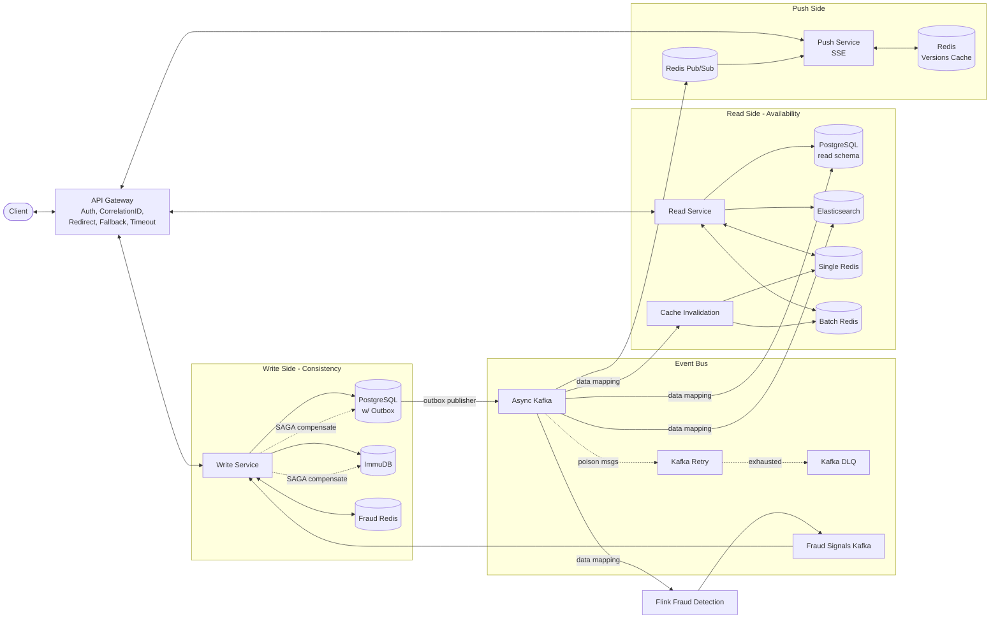
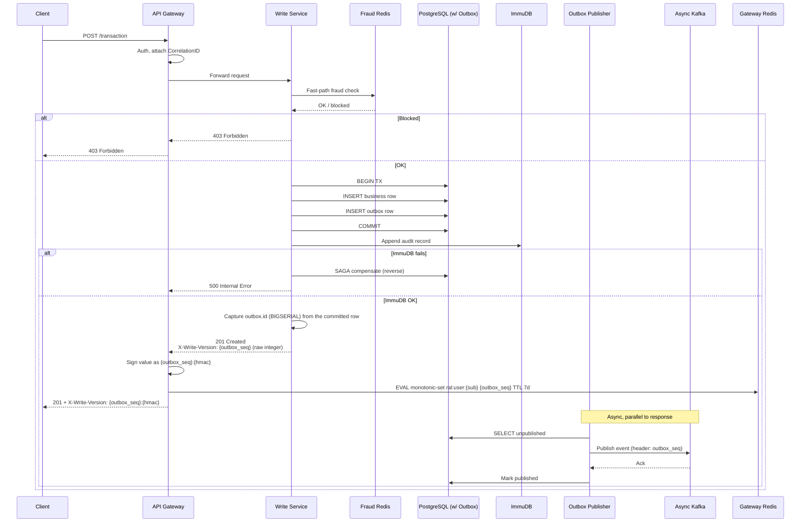
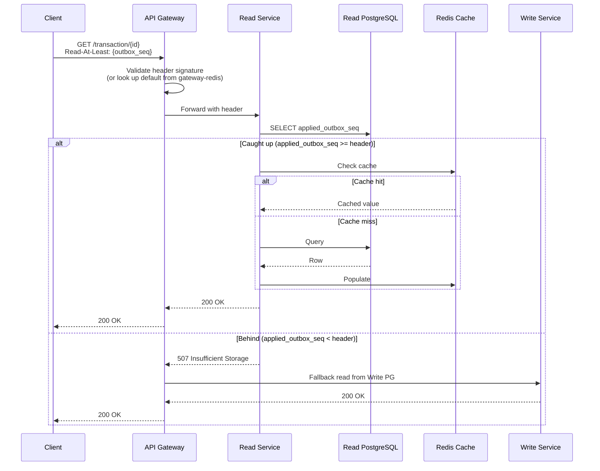
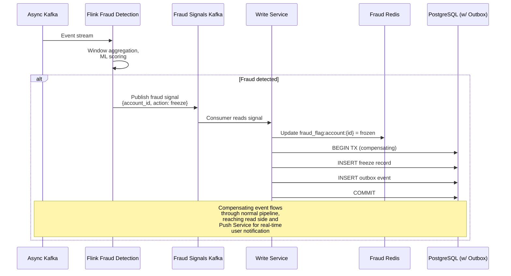
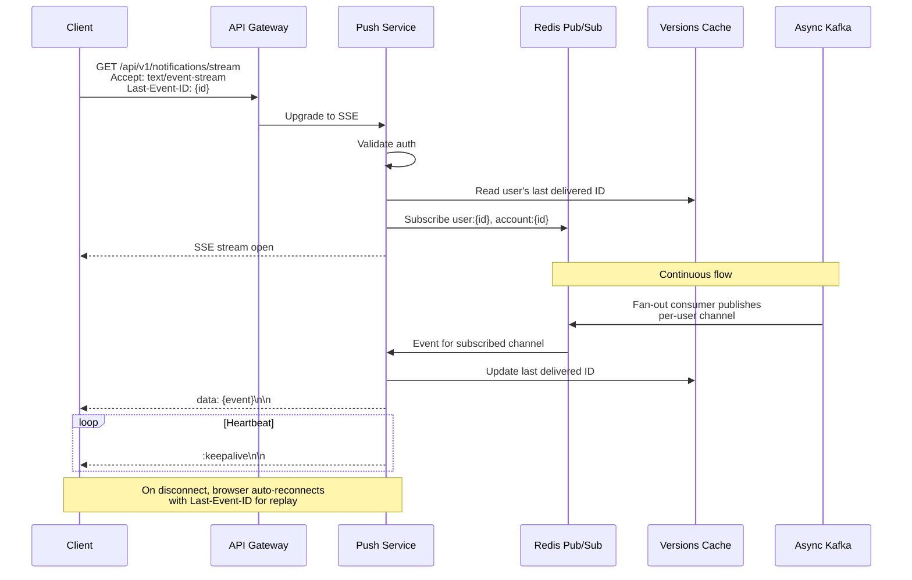

# Fintech CQRS Architecture — Technical Specification

A learning-project fintech system built on CQRS with separate write and read services, eventual consistency on the read side with explicit read-your-writes mechanics, two-tier fraud detection, and real-time push updates via SSE.

---

## Table of Contents

1. [Architectural Overview](#architectural-overview)
2. [System Diagram](#system-diagram)
3. [Components](#components)
4. [Data Flows](#data-flows)
5. [Patterns and Decisions](#patterns-and-decisions)
6. [Cross-Cutting Concerns](#cross-cutting-concerns)
7. [Implementation Notes](#implementation-notes)

---

## Architectural Overview

The system separates write and read concerns into distinct services (CQRS). The write path is synchronous and consistency-oriented (CAP: C); the read path is eventually consistent and availability-oriented (CAP: A). The two are bridged by a Kafka-based event pipeline fed by a transactional outbox in the write service's PostgreSQL.

Key design properties:

- **Write side** — synchronous persistence to PostgreSQL (with outbox table) + ImmuDB (immutable audit log). SAGA compensation between the two. Outbox publisher emits events to Async Kafka.
- **Read side** — multiple projections (PostgreSQL, Elasticsearch) consumed asynchronously from Async Kafka. Two Redis caches (single-resource and paginated). Cache invalidation driven by the same event stream.
- **Consistency** — clients can opt into read-your-writes via a `Read-At-Least` header carrying a Postgres outbox seq (the `BIGSERIAL` row id assigned at commit time). Read Service returns 507 if not caught up; Gateway falls back to Write Service for consistency-required reads. (507 Insufficient Storage is repurposed as the "read model behind" signal, distinct from a 503 meaning the service itself is unavailable — so the gateway can tell "fall back to write side" apart from "retry later".)
- **Fraud detection** — two tiers: synchronous fast-path (Fraud Redis lookup in Write Service) and asynchronous deep-path (Flink consuming Async Kafka, publishing detected fraud to Fraud Signals Kafka).
- **Real-time UX** — Push Service maintains SSE connections, consumes Async Kafka via Redis Pub/Sub for cross-instance fan-out, pushes updates to connected clients.

---

## System Diagram

### High-Level Architecture



---

## Components

### Client

The end-user application (web/mobile). Communicates only through the API Gateway. Maintains an SSE connection to the Push Service for real-time updates.

**Responsibilities:**
- Issue REST requests through API Gateway
- Maintain SSE connection for live updates
- Track latest write version (outbox seq returned on writes as `X-Write-Version`) and pass it as `Read-At-Least` header on subsequent reads when read-your-writes is required
- Handle 507 responses with retry/backoff (read model not yet caught up)

---

### API Gateway

Stateless edge component handling cross-cutting request concerns.

**Implementation:** Kong (open-source). Custom logic implemented as Kong plugins:
- `clerk-jwt` — validates Clerk session tokens, stashes claims for downstream plugins
- `read-at-least` — request-side: verifies inbound `Read-At-Least` HMAC and injects a default from per-user Redis on read routes
- `write-version` — response-side: signs the raw `X-Write-Version` emitted by Write Service and records `(user_id, seq)` to Redis on write routes
- `user-tier-rate-limit` — per-user rate caps layered on top of Kong's bundled IP rate-limiting. Sliding window: two Redis buckets per window, the previous one weighted by how much of it the window still covers, decided and incremented in one atomic script so concurrent requests cannot both pass the same check
- `read-fallback` — on read routes, transparently redirects a Read Service 507 to the Write Service's fallback-read endpoint

**Responsibilities:**
- **Auth** — validate bearer tokens; attach authenticated identity to downstream requests
- **CorrelationID** — generate or propagate a correlation ID for distributed tracing across all downstream calls and Kafka events
- **Requests Redirect / Fallback** — the `read-fallback` plugin self-proxies each read in the `access` phase (the only phase that sees the upstream status and still permits the HTTP call); when the Read Service returns 507 (not caught up to `Read-At-Least`) it re-issues the request to the Write Service's `/api/v1/fallback-reads/…` endpoint and returns that instead, so the client never sees the 507. The forwarded request carries the `X-User-Id` and resolved `Read-At-Least` headers the upstream plugins already set.
- **Timeout** — enforce upper bounds on request duration regardless of downstream behavior
- Own the HMAC secret used to bind `Read-At-Least` and `X-Write-Version` so upstream services never see it
- Verify the HMAC of inbound `Read-At-Least` headers on read routes to prevent client forgery
- On write responses: intercept the raw outbox seq emitted by Write Service as `X-Write-Version`, sign it in-place (`{seq}:{hmac}`) before returning to the client, and best-effort record `(user_id, seq)` in `gateway-redis` under `ral:user:{sub}`
- On read requests without `Read-At-Least`: look up `ral:user:{sub}` in `gateway-redis`, sign the value, and inject the default header — gives stateless clients read-your-writes without tracking versions themselves
- Pass through SSE connections to Push Service with appropriate timeout/buffering configuration

**Critical configuration for SSE:**
- HTTP/2 enabled
- Idle timeouts disabled or set very high for the SSE endpoint (`/api/v1/notifications/stream`)
- Response buffering disabled
- Heartbeat configuration aware

---

### Write Service

Synchronous, consistency-oriented service that owns all write operations.

**Responsibilities:**
- Receive write requests from Gateway
- Perform synchronous fast-path fraud check against Fraud Redis (velocity rules, blocklists, account freeze flags)
- Persist to PostgreSQL (operational data + outbox row in same transaction)
- Persist to ImmuDB (immutable audit log)
- Coordinate SAGA between PostgreSQL and ImmuDB (compensate on partial failure)
- Return canonical record + outbox seq as a raw integer in the `X-Write-Version` response header. The outbox seq is the `BIGSERIAL` row id assigned by Postgres inside the write transaction, so it is known synchronously at response time (no wait on Kafka publish). Write Service stays ignorant of HMAC signing and Redis bookkeeping — the gateway intercepts the response header and handles both.
- Serve **always-consistent fallback reads** under `GET /api/v1/fallback-reads/{wallets,transactions}/[{id}/]`. These read the source of truth directly — wallet rows from Postgres, balances folded from the ImmuDB ledger (checkpoint + unsettled tail) — so they are slower than the Read Service but never stale. The append-only transaction ledger is **collapsed to match the projection**: effect rows (inverses / adjustments) are hidden, cancelled originals are dropped, and adjustment deltas are folded into the original's amount, so original + effects yield one transaction or none. The gateway routes here on a 507 from the Read Service. Responses deliberately mirror the Read Service's payload shape so the swap is transparent to clients.
- Consume Fraud Signals Kafka to:
  - Update Fraud Redis when accounts are flagged
  - Issue compensating transactions for already-committed fraud

**CAP property:** Consistency (synchronous, blocks until persisted)

**Key constraint:** ImmuDB writes happen in the request path. Cryptographic chaining adds latency; measure and decide whether to keep synchronous or move to async-via-outbox if budget exceeded.

---

### PostgreSQL (Write)

The operational source of truth. Contains:
- Business data tables (transactional schema, normalized)
- `outbox` table for the transactional outbox pattern

**Outbox table schema (suggested):**

```sql
CREATE TABLE outbox (
    id BIGSERIAL PRIMARY KEY,
    aggregate_type VARCHAR(255) NOT NULL,
    aggregate_id VARCHAR(255) NOT NULL,
    event_type VARCHAR(255) NOT NULL,
    payload JSONB NOT NULL,
    correlation_id VARCHAR(255) NOT NULL,
    created_at TIMESTAMPTZ DEFAULT now()
);

-- No `published_at` / unpublished index needed: Debezium tracks progress via
-- replication slot LSN, not application columns. The Write Service may DELETE
-- rows in the same transaction as the INSERT (Debezium still captures the
-- INSERT from WAL), or keep them for debuggability + run a periodic cleanup.
```

Writes to business tables and outbox happen in the same Postgres transaction, guaranteeing atomicity.

---

### Outbox Publisher (Debezium / Kafka Connect)

Streams new outbox rows to Async Kafka via Postgres logical decoding. Decoupled from the Write Service request path and process lifecycle.

**Implementation:** Debezium Postgres connector running on a Kafka Connect cluster. Uses Postgres logical replication (`pgoutput` plugin, dedicated replication slot + publication scoped to the `outbox` table). Debezium's **Outbox Event Router** SMT (Single Message Transformer) extracts `partitionkey` (→ Kafka message key; the owning user's external Clerk id, or `GLOBAL` for unowned events), `event_type` (→ topic name or header), and `payload` (→ message value), so consumers see clean business events rather than raw row-change records.

**Postgres prerequisites:**
- `wal_level = logical`
- A replication user with `REPLICATION` privilege
- A publication for the `outbox` table
- `max_slot_wal_keep_size` set to bound WAL growth if Debezium falls behind

**Outbox row lifecycle:**
- Write Service `INSERT`s rows in the same transaction as business writes (atomicity preserved)
- Debezium captures the insert from WAL and publishes to Kafka
- Rows can be deleted immediately after insert in the same transaction (Debezium still captures the insert from WAL); the table never accumulates rows. Alternatively keep rows + a periodic cleanup job for debuggability.
- The `published_at` column from the earlier polling design is **not needed** — Debezium tracks progress via replication slot LSN, not application columns.

**Operational notes:**
- Debezium runs as its own deployment (Kafka Connect worker), not inside Write Service
- Replication slot lag must be alerted on — a stuck Debezium instance grows WAL on the Write Postgres unboundedly
- Connector restart resumes from the last committed LSN; at-least-once delivery, idempotent consumers handle duplicates

---

### ImmuDB

Immutable, cryptographically verifiable audit log.

**Role:**
- Tamper-evident audit record for compliance
- Verification proofs can be checked by external auditors
- Append-only — "compensation" means writing a new record indicating the reversal, not deleting

**Coordination with PostgreSQL:**
- SAGA pattern: Write Service writes to Postgres, then ImmuDB
- If ImmuDB write fails, Postgres transaction is rolled back (or compensating record written if already committed)
- If Postgres rollback fails after ImmuDB success, write a compensating record to ImmuDB

---

### Fraud Redis

In-memory store for synchronous fraud fast-path checks.

**Stores:**
- Account freeze flags (`fraud_flag:account:{id}` → frozen/active)
- Velocity counters (`velocity:{user_id}:{window}` → count)
- Blocklists (devices, IPs, accounts)
- Hard-limit configurations

**Updated by:**
- Write Service consumer of Fraud Signals Kafka (when Flink flags an account)
- Periodic refresh from authoritative source

---

### Async Kafka

Primary event bus carrying business events from the write side to read-side projections.

**Topology:**
- `events.async` — main topic; partitioned by aggregate ID (e.g., account ID) for ordered per-account processing
- `events.retry` — retry topic with timestamp-based delay; consumers re-publish to main after delay expires
- `events.dlq` — dead letter queue for poison messages; manual replay tooling required

**Configuration:**
- Producer: `acks=all`, `linger.ms=0` for fraud-relevant events, idempotent producer enabled
- Consumers: idempotent processing required, manual offset commit after successful processing
- Partition key: aggregate ID (e.g., account ID) to preserve ordering within an account

---

### Fraud Signals Kafka

Dedicated topic for detected fraud events flowing from Flink back to the Write Service.

**Why a separate topic:**
- Different consumer (Write Service) than Async Kafka consumers (Read projections)
- Different priority — fraud signals may need their own consumer to avoid being delayed by Read pipeline lag
- Cleaner audit trail
- Multiple downstream consumers possible (notification service, ops dashboard, audit log)

**Partition key:** account ID (so freeze/unfreeze sequences for same account are ordered)

---

### Flink Fraud Detection

Stream processing job consuming Async Kafka, performing windowed analysis and ML scoring.

**Responsibilities:**
- Consume `events.async` topic
- Maintain windowed state (transaction velocity, geographic patterns, behavioral baselines)
- Score transactions for fraud likelihood
- When score exceeds threshold, emit fraud signal to `fraud.signals` Kafka topic

**State backend:** RocksDB with checkpointing to durable storage (S3, HDFS)

**Note:** Flink consumes events with "data mapping" — a translation layer that converts the Write schema events into a fraud-detection-friendly structure.

---

### PostgreSQL (Read)

Read-optimized projection of the operational data.

**Key differences from Write Postgres:**
- Different schema (denormalized for read access patterns)
- Indexes optimized for query patterns, not write throughput
- Eventually consistent — populated by Async Kafka consumer

**Consumer:** A "Postgres projection consumer" reads Async Kafka and applies events to the read schema. This consumer owns the schema translation logic ("data mapping").

**Read-At-Least support:** The consumer extracts the originating outbox seq from each consumed event (carried as the `outbox_seq` Kafka header set by the outbox publisher at publish time) and persists the highest applied value **per user** (`read_applied_outbox_seq` table), committed in the same transaction as the projection write so the recorded seq never runs ahead of the data. Tracking is per-user because events are partitioned by user and a client's `Read-At-Least` always refers to one of their own writes. The Read Service compares this `applied_outbox_seq` against the `Read-At-Least` header to decide between serve / 507. Implemented in `libraries/read-at-least-py` (storage-agnostic decision logic) + `data_read_core/shared/read_at_least` (Django glue).

---

### Elasticsearch

Search and analytics projection.

**Used for:**
- Full-text search across transactions
- Aggregations and dashboards
- Complex filter queries

**Consumer:** ES indexer reads Async Kafka and indexes documents. Owns its own schema translation. Uses alias-based index management for zero-downtime reindexing.

**Caveat:** ES mapping changes are not easily backward-compatible — plan for periodic alias swaps to new indexes.

---

### Read Service

Stateless query service.

**Responsibilities:**
- Serve read queries by routing to appropriate backing store (Postgres for transactional reads, ES for search, Redis for cached items)
- Implement cache-aside pattern: check Redis → fall through to Postgres/ES → populate cache
- Honor `Read-At-Least` header:
  - Compare requested outbox seq to the user's current `applied_outbox_seq`
  - If caught up: serve normally
  - If behind: return 507 immediately so the gateway falls back to the Write Service
  - (Optional future optimization: a short bounded wait/re-check before 507 to absorb sub-second projection lag)

**CAP property:** Availability (may be stale, but always responsive)

**Note:** The Read Service does NOT write to the backing stores — those are populated by Async Kafka consumers.

---

### Single Redis (cache)

Cache for individual resource lookups (e.g., transaction by ID, account by ID).

**Pattern:** Cache-aside
- Read Service checks Redis first
- On miss, query Postgres, populate Redis with TTL
- On Async Kafka event for an entity, Cache Invalidation Service deletes the corresponding key

**Key format:** `single:{entity_type}:{id}` (e.g., `single:transaction:abc123`)

---

### Batch Redis (cache)

Cache for paginated and list query results.

**Invalidation strategy** (must be chosen explicitly):

Option A — **Tag-based invalidation:** Each cache entry tagged with an aggregate ID. When event arrives for that aggregate, all tagged entries deleted.
```
Key: batch:user:{uid}:transactions:page:{n}
Tag: user:{uid}
```

Option B — **Versioned keys:** Include a per-aggregate version number in keys. Bump version on event; old keys become unreachable and TTL out.
```
Key: batch:user:{uid}:v{version}:transactions:page:{n}
Version stored in Redis: version:user:{uid}
```

Option C — **No batch caching:** Cache underlying entities only (Single Redis), paginate every request. Simpler, may be acceptable depending on read volume.

**Pick one explicitly.** Pagination cache invalidation is genuinely hard and the choice affects implementation significantly.

---

### Cache Invalidation (component of Read Service)

Consumer of Async Kafka responsible for invalidating Redis caches when underlying data changes.

**Responsibilities:**
- Subscribe to relevant Async Kafka topics
- For each event, identify affected cache keys/tags
- Delete or version-bump corresponding Redis entries
- Publish cache invalidation events to Push Service if needed (so connected clients can refetch)

**Deployment:** Separate process from the Read Service HTTP API, but same codebase (shares models, Redis clients, mapping logic). Runs as a long-lived Kafka consumer loop, exposed via a Django management command (e.g., `manage.py run_cache_invalidator`) launched in its own container in compose / its own pod in Kubernetes.

**Why split:**
- Independent scaling — event spikes don't degrade HTTP latency
- Independent restarts — Read API redeploys don't drop in-flight consumer state
- Same codebase — cache key conventions and entity mappings stay co-located with the Read Service code that reads from those caches

---

### Push Service

Manages long-lived SSE connections to clients for real-time updates.

**Responsibilities:**
- Accept SSE connection upgrades from API Gateway
- Authenticate connections (bearer token validated at connection establishment)
- Subscribe to Redis Pub/Sub channels relevant to connected user
- Push events to connected clients in SSE format
- Send heartbeat (`:keepalive\n\n`) every 15-30 seconds to prevent proxy timeouts
- Honor `Last-Event-ID` on reconnect for missed-event replay (sourced from Redis Versions Cache)

**Scaling considerations:**
- Connection-bound (memory per connection), not CPU-bound
- Horizontal scale via more instances; cross-instance event delivery via Redis Pub/Sub
- Different deployment lifecycle than Read Service (avoid dropping connections on Read deploys)

---

### Redis Pub/Sub

Cross-instance event distribution mechanism for the Push Service.

**Why needed:** A user may connect to Push Service instance A, but the Async Kafka event arrives at instance B. Redis Pub/Sub fans events from any consumer instance to the instance holding the user's connection.

**Channels:**
- `user:{user_id}` — events relevant to a specific user
- `account:{account_id}` — events for accounts (multi-user accounts possible)

**Source:** A consumer (could be the Push Service itself or a separate "fan-out" component) reads Async Kafka, identifies recipient users for each event, publishes to the appropriate Redis channel.

---

### Redis Versions Cache

Stores latest pushed event ID per CorrelationID/user for SSE reconnect replay.

**Why needed:** When a client disconnects and reconnects, it sends `Last-Event-ID`. The Push Service needs to replay events from that point forward. The Versions Cache records the latest event ID delivered to each user.

**Note:** This is short-lived state. For longer replay windows, consume directly from Async Kafka with a per-connection offset.

---

## Data Flows

### Write Flow



**Notes:**
- The outbox publisher runs continuously, decoupled from the request path
- Write Service returns the outbox seq as a raw integer. The gateway HMAC-signs it before forwarding to the client and writes `(user_id, outbox_seq)` to `gateway-redis` under `ral:user:{user_id}` via a monotonic Lua script. Both the secret and the Redis dependency stay inside the gateway.
- The Redis write is best-effort and runs synchronously inside the response phase; if it fails, the response is unaffected and the client can still use the signed `X-Write-Version` directly as `Read-At-Least`
- Postgres + Outbox writes are in the same transaction → atomic
- Postgres + ImmuDB are coordinated via SAGA, not atomic

---

### Read Flow with Read-Your-Writes



**Notes:**
- Read-At-Least is optional; reads without it serve from Read Service immediately
- Gateway fallback to Write Service is the consistency safety net
- The wait window (200ms) is tunable per route based on tolerance

---

### Fraud Detection Flow



**Notes:**
- Fast-path fraud check happens synchronously on every write (Fraud Redis lookup)
- Deep-path detection runs in Flink, asynchronously
- Detected fraud triggers a compensating transaction through the same write path
- The compensating event then propagates to read side and pushed to user via SSE

---

### Push Flow (SSE)



---

## Patterns and Decisions

### CQRS (Command Query Responsibility Segregation)

Separate Write Service and Read Service. Different optimization criteria (consistency vs availability), different scaling profiles, different schemas.

### Transactional Outbox

Solves the dual-write problem between Postgres and Kafka. Business write + outbox row in the same Postgres transaction; separate publisher process emits to Kafka with at-least-once semantics. Idempotent consumers handle duplicates.

### SAGA (Postgres ↔ ImmuDB)

Two-step write across Postgres and ImmuDB cannot be atomic; coordinated via SAGA with compensating actions. ImmuDB's append-only nature means "compensation" is an additional immutable record indicating the reversal.

### Read-Your-Writes via Version Token

Write Service returns the outbox seq (`BIGSERIAL` row id) as a raw integer in the `X-Write-Version` response header. The gateway intercepts the response, HMAC-signs the value into `{seq}:{hmac}`, and writes `(user_id, seq)` to `gateway-redis` (`ral:user:{sub}`) via a monotonic Lua `SET`. The client receives the already-signed header and sends it back verbatim as `Read-At-Least` on subsequent reads. Read Service compares the requested seq to the user's `applied_outbox_seq`, serving normally or returning 507. Gateway falls back to Write Service on 507.

When the client omits `Read-At-Least`, the gateway looks up the user's latest seq in `gateway-redis` and injects a freshly-signed default header. Cache miss or Redis unavailable → no header, eventually-consistent read. This lets stateless / freshly-loaded clients still get read-your-writes without tracking versions client-side.

**Why the gateway owns HMAC and Redis:** keeping the HMAC secret out of Write Service means rotating the secret is a gateway-only operation, and a Write Service compromise can't forge `Read-At-Least` headers. Write Service emits a plain integer and never sees the per-user Redis. The gateway is the single trust boundary for the consistency-token mechanism.

**Why outbox seq instead of Kafka offset:** the outbox row id is assigned by Postgres inside the write transaction, so Write Service knows it synchronously at response time. Using the Kafka offset would force the request path to block on publish or fall back to a less-fresh signal. The outbox seq is monotonic per Postgres instance and survives Kafka partition rebalances unchanged.

### Two-Tier Fraud Detection

- **Fast-path** (synchronous, in Write Service): cheap rules, blocklists, freeze flags via Fraud Redis. Sub-millisecond.
- **Deep-path** (async, Flink): windowed aggregations, ML scoring. Seconds to minutes. Outputs to Fraud Signals Kafka, consumed by Write Service to update Fraud Redis and issue compensations.

### Cache-Aside with Event-Driven Invalidation

Read Service uses cache-aside pattern (read-through cache). Cache Invalidation Service consumes Async Kafka and invalidates affected cache keys. Pagination cache invalidation strategy must be explicitly chosen (tag-based, version-based, or no batch caching).

### SSE for Real-Time Push

Server-Sent Events for unidirectional server → client push. Simpler than WebSocket for this use case. Push Service is separate from Read Service due to different scaling characteristics.

---

## Cross-Cutting Concerns

### Idempotency

All Kafka consumers must process events idempotently. Idempotency key is the event's unique ID (UUID generated at outbox insertion).

**Implementation patterns:**
- Postgres consumer: `INSERT ... ON CONFLICT DO NOTHING` with event ID as unique key
- Elasticsearch: use event ID as document version, with version conflict handling
- Cache invalidation: deletion is naturally idempotent
- Push Service: deduplicate by event ID before delivery

### Consistency Guarantees

- **Write side:** linearizable within a Postgres transaction; eventually consistent with ImmuDB (SAGA)
- **Async pipeline:** at-least-once delivery, idempotent consumers
- **Read side:** eventually consistent by default; read-your-writes available via header
- **Ordering:** preserved per partition key (the owning user's external Clerk id); no global ordering

### Observability

Required cross-cutting infrastructure (not shown explicitly in diagram):

- **Distributed tracing:** CorrelationID generated at Gateway, propagated through:
  - HTTP headers (`X-Correlation-ID`)
  - Kafka message headers
  - Database query comments (for trace-to-query correlation)
- **Metrics:** request latency per route, Kafka consumer lag per topic, replication slot lag, cache hit rates, SSE connection counts
- **Logging:** structured logs with correlation ID at every component
- **Alerting:** consumer lag thresholds, DLQ depth, replication slot lag, failed SAGA compensations

### Schema Evolution

- **Kafka events:** Avro/Protobuf with Schema Registry; backward-compatible changes only without explicit migration
- **Postgres (write):** zero-downtime migrations, backward-compatible during deploy windows
- **Postgres (read):** schema owned by the data mapping consumer; reindexing strategy required for breaking changes
- **Elasticsearch:** alias-based index management; reindex to new mapping, swap alias atomically

### Security

- TLS for all inter-service communication
- Auth tokens validated at Gateway; downstream services trust Gateway-attached identity
- Field-level encryption for PII in Kafka events (so consumers needn't be individually secured for PII)
- ImmuDB write access tightly controlled — verification proofs checked periodically
- Fraud Redis flags treated as authoritative; cannot be bypassed

### Failure Handling

- **Postgres unavailable:** Write Service returns 503; client retries with backoff
- **ImmuDB unavailable:** SAGA fails; Postgres compensation; 500 to client
- **Async Kafka unavailable:** Outbox publisher backs off; outbox grows but doesn't lose data
- **Read Postgres unavailable:** Read Service falls back to Write Postgres for eligible reads (requires read-only replica access)
- **Cache unavailable:** Read Service serves directly from Postgres/ES (degraded performance, but available)
- **Push Service unavailable:** clients fall back to polling or stale data with eventual consistency
- **Flink unavailable:** fraud detection delayed; fast-path still operates; Flink replays from checkpoint

---

## Implementation Notes

### Technology Stack (Suggested)

| Component | Technology |
|-----------|------------|
| API Gateway | Kong (open-source) |
| Write Service | Any (Go, Java, Node.js, Python) |
| PostgreSQL | PostgreSQL 15+ |
| ImmuDB | Latest stable |
| Fraud Redis | Redis 7+ |
| Async Kafka | Apache Kafka with Schema Registry |
| Flink | Apache Flink with RocksDB state backend |
| PostgreSQL (Read) | PostgreSQL 15+ |
| Elasticsearch | Elasticsearch 8+ |
| Cache (Single/Batch Redis) | Redis 7+ |
| Read Service | Any |
| Push Service | Any (Go or Node.js are particularly well-suited for many concurrent connections) |
| Outbox Publisher | Debezium Postgres connector on Kafka Connect, with Outbox Event Router SMT |
| Cache Invalidation | Django management command (Kafka consumer loop), shipped as separate process inside Read Service codebase |

### Key Configuration

**Kafka producer (Write Service / Outbox Publisher):**
```
acks=all
enable.idempotence=true
linger.ms=0  # for fraud-relevant; tune up for throughput-tolerant
compression.type=lz4
```

**Kafka consumer (all):**
```
enable.auto.commit=false  # commit after successful processing
isolation.level=read_committed
auto.offset.reset=earliest
```

**PostgreSQL (Write):**
- WAL retention: enough for outbox publisher backlog
- `max_slot_wal_keep_size`: set to prevent unbounded WAL growth from stuck consumers (if using CDC)

**SSE / Push Service:**
- HTTP/2 or HTTP/1.1 with `Connection: keep-alive`
- Heartbeat interval: 15-30s
- Max connections per instance: tune based on memory profile (10k-100k feasible)

### Open Decisions for Implementer

1. **Pagination cache strategy:** tag-based, version-based, or none — pick one before implementing Cache Invalidation
2. ~~**Read-At-Least timeout window:** how long Read Service waits for catchup before 503 (suggest 100-200ms)~~ — **Decided:** Read Service returns 507 immediately on a behind read (no wait); the gateway falls back to the Write Service. A bounded wait/re-check before 507 remains an optional future optimization.
3. **Fraud detection thresholds and rules:** outside this spec; depends on fraud model
4. **ImmuDB write placement:** synchronous in request path (current spec) vs async via outbox (lower latency, more complex)
5. ~~**Outbox publisher mechanism:** polling (simpler) vs Debezium logical decoding (real-time, more ops)~~ — **Decided:** Debezium Postgres connector on Kafka Connect, with Outbox Event Router SMT. Requires `wal_level=logical`, replication slot monitoring, and a Kafka Connect deployment.
6. **Schema translation ownership:** one consumer per projection (Postgres, ES, Cache, Flink) each owns its mapping; no shared translation layer

### Things Explicitly Out of Scope

- User registration / account management (assumed pre-existing)
- KYC / regulatory onboarding flows
- Settlement / clearing integrations
- Specific fraud detection model implementation
- Frontend/UI implementation details (only the SSE and version-token contract is specified)
- Multi-region / disaster recovery (single-region assumed)

---

## Appendix: Event Schema Example

```json
{
  "event_id": "01HXYZ...",
  "event_type": "transaction.created",
  "aggregate_type": "transaction",
  "aggregate_id": "txn_abc123",
  "correlation_id": "corr_xyz789",
  "occurred_at": "2026-05-10T14:11:39Z",
  "version": 1,
  "payload": {
    "transaction_id": "txn_abc123",
    "account_id": "acc_456",
    "amount": "100.00",
    "currency": "USD",
    "type": "transfer",
    "status": "pending"
  },
  "metadata": {
    "user_id": "usr_789",
    "ip_address": "...",
    "user_agent": "..."
  }
}
```

This event structure is consumed by all Async Kafka consumers; each performs its own data mapping into its target schema.
