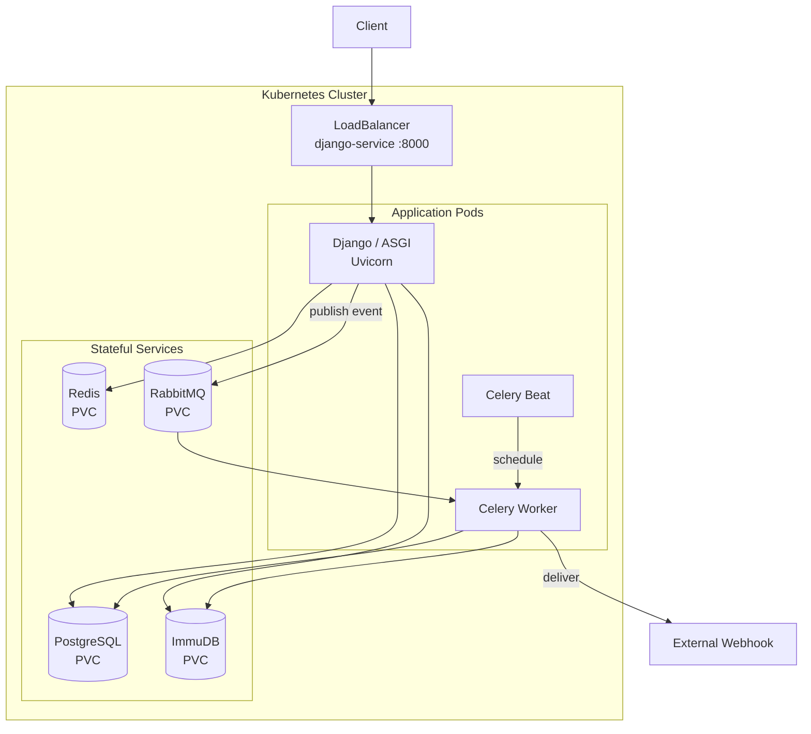
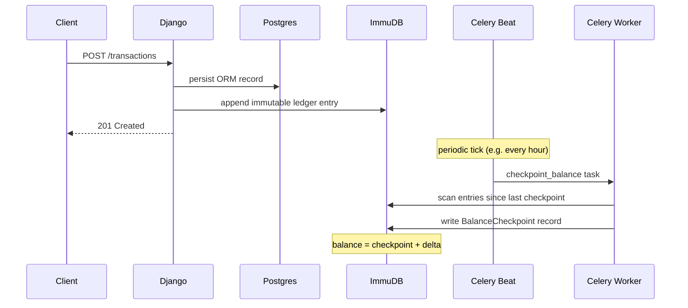
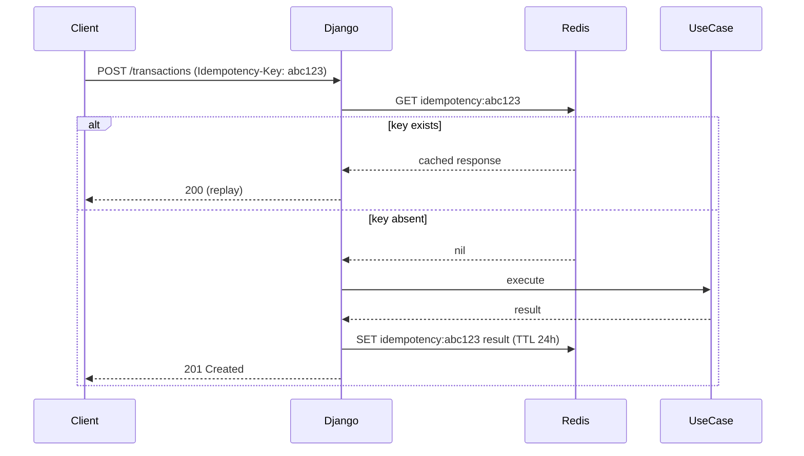

# Feature Proposals

Implementation proposals for production system concepts. Each folder contains a detailed README covering: motivation, production concepts taught, domain model, implementation notes, and key blockwalls.

## Sprint 1 — Completed

| Feature | Core Concept | Commit |
|---|---|---|
| Health Probes | k8s readiness/liveness — required for deploy | pre-sprint |
| Idempotency Keys | Financial correctness, safe retries | `8b1f18f` |
| Rate Limiting | Redis sliding window throttle | `7c9a63a` |
| Async Migration | ASGI, async views, async ORM, httpx | `9aece66` |
| Ledger-Based Balance (ImmuDB) | Immutable transaction log, derived balance | `a50d5ef` |
| Balance Checkpoint | Celery Beat periodic CQRS read-model | `e245c79` |
| Kubernetes Deployment | Load balancer, PVCs, RBAC, secrets, configmap | `d04dd3f` |

## Remaining Build Order

| Priority | Feature | Core Concept | Done |
|---|---|---|---|
| 1 | [Subscriptions Management](./subscriptions-management/) | State machines, dunning, Celery Beat billing | :x: |
| 2 | [Money Transfers](./money-transfers/) | Distributed atomicity, deadlock prevention | :x: |
| 3 | [OpenTelemetry Tracing](./opentelemetry-tracing/) | Distributed observability for k8s | :x: |
| 4 | [Cursor Pagination](./cursor-pagination/) | Scale-proof pagination, keyset queries | :x: |
| 5 | [Audit Log](./audit-log/) | Immutable ledger, compliance, event history | :x: |
| 6 | [Piggy Bank](./piggy-bank/) | Savings goals, scheduled contributions | :x: |
| 7 | [Split Payments](./split-payments/) | Multi-party billing, debt coordination | :x: |

## System Architecture (after Sprint 1)

## Ledger + Balance Checkpoint Flow

## Idempotency Key Flow

## Why This Order (Remaining)

Items 1–2 are core financial domain complexity: state machines and distributed atomicity.
Items 3–5 are observability and compliance — production k8s workloads require these.
Items 6–7 are domain feature complexity, lower infrastructure value.
