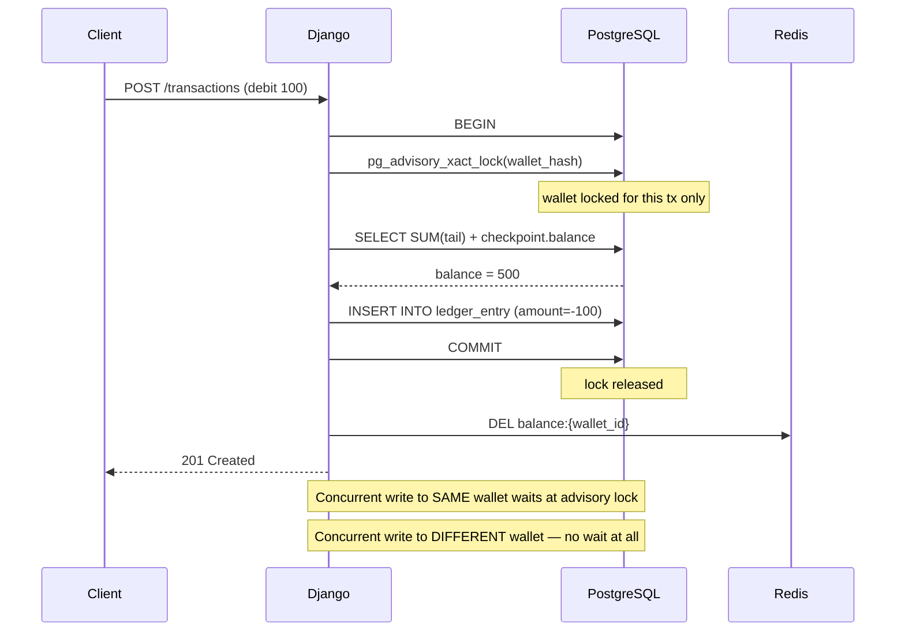
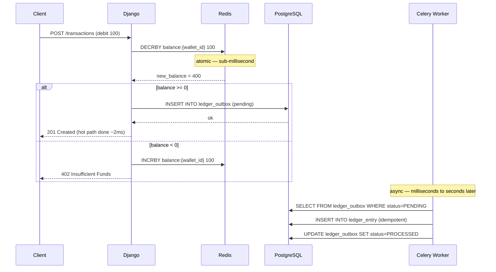
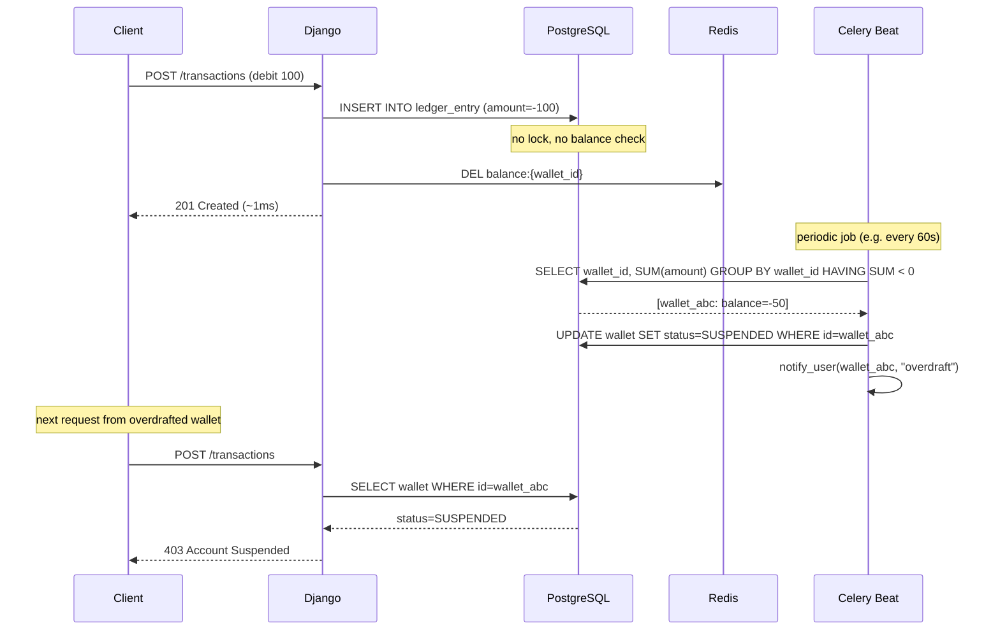

# Ledger-Based Balance with CQRS

## Why

The current model stores balance as a mutable field on `Wallet`. Every transaction updates it. This is convenient but architecturally fragile: the balance can drift from reality (bug, race condition, failed partial update), and you can never reconstruct *how* the balance reached its current value.

A ledger-based model flips this: **the ledger is the source of truth, the balance is a derived value**. This is how banks actually work — no balance field exists at the core; balance is always computed from the sum of credits and debits.

## Production Concepts Taught

- **Event sourcing (lite)** — current state derived from immutable history of events
- **CQRS** — write model (ledger entries) separate from read model (balance cache)
- **Append-only / immutable data** — no UPDATE or DELETE on financial records
- **Checkpointing / snapshotting** — bound query cost as history grows
- **Cache invalidation** — Redis balance cache invalidated on new ledger writes
- **Read-path optimization** — separate concerns of writing transactions and reading balances
- **Double-entry bookkeeping** — every debit has a matching credit, books always balance

## Core Concept

```
Traditional model:
  wallet.balance = 500           ← mutable, source of truth, can drift

Ledger model:
  wallet has no balance field
  balance = SELECT SUM(amount) FROM ledger WHERE wallet_id = X
            ← derived, always correct, fully auditable
```

Any discrepancy between expected and actual balance is impossible by construction — the balance *is* the ledger.

## Why PostgreSQL, Not MongoDB

MongoDB is tempting for an append-only workload, but the wrong choice here:

| Concern | PostgreSQL | MongoDB |
|---|---|---|
| ACID transactions | Native, battle-tested | Multi-doc transactions exist but slower |
| Foreign key enforcement | Yes | No |
| CHECK constraints | Yes | No — app must enforce |
| Relational integrity (entry ↔ wallet ↔ user) | Enforced by DB | Enforced by app only |
| Flexible per-entry metadata | `jsonb` column | Native |
| Append-only enforcement | `RULE` / trigger | No native mechanism |
| Aggregation performance | Window functions, indexes | Aggregation pipeline |

The interesting challenges (immutability, checkpointing, CQRS, cache invalidation) are better demonstrated on PostgreSQL where the DB enforces correctness rather than relying on the application.

## Domain Model

### LedgerEntry (append-only)

```
id: UUID (PK)
wallet_id: UUID (FK Wallet)
amount: Decimal                  — positive = credit, negative = debit
currency: str
entry_type: LedgerEntryType
reference_id: UUID | null        — links to Transaction, Transfer, BillingAttempt, etc.
reference_type: str | null       — 'transaction', 'transfer', 'subscription_billing'
metadata: jsonb                  — entry-type-specific data
created_at: timestamp            — indexed

CONSTRAINT: no UPDATE, no DELETE
```

### LedgerEntryType

```python
class LedgerEntryType(str, Enum):
    INCOME          = "income"           # external money in
    EXPENSE         = "expense"          # external money out
    TRANSFER_DEBIT  = "transfer_debit"   # sent to another wallet
    TRANSFER_CREDIT = "transfer_credit"  # received from another wallet
    ADJUSTMENT      = "adjustment"       # correction entry
    FEE             = "fee"              # system fee
    REVERSAL        = "reversal"         # reversal of a prior entry
```

### BalanceCheckpoint

```
id: UUID (PK)
wallet_id: UUID (FK Wallet)           — indexed
balance: Decimal
currency: str
as_of_entry_id: UUID (FK LedgerEntry) — all entries UP TO AND INCLUDING this one
                                         are captured in `balance`
created_at: timestamp
```

Checkpoints are written by a Celery Beat task. They are also immutable — never updated, only superseded by a newer checkpoint.

### Wallet (modified)

```
id: UUID
user_id: UUID
name: str
currency: str
— balance field REMOVED —
created_at: datetime
updated_at: datetime
deleted_at: datetime | null
```

## Balance Calculation

### Naive (correct but slow at scale)

```sql
SELECT SUM(amount)
FROM ledger_entry
WHERE wallet_id = $1;
```

Cost grows linearly with ledger history. Unacceptable at millions of entries.

### Optimized with Checkpoint

```sql
-- Step 1: find latest checkpoint
SELECT balance, as_of_entry_id
FROM balance_checkpoint
WHERE wallet_id = $1
ORDER BY created_at DESC
LIMIT 1;

-- Step 2: sum entries created AFTER the checkpoint entry
-- (using entry UUID ordering, not timestamp — avoids clock skew)
SELECT SUM(amount)
FROM ledger_entry
WHERE wallet_id = $1
  AND id > $as_of_entry_id;  -- UUID comparison uses insertion order

-- Result: checkpoint.balance + tail_sum
```

With daily checkpoints and moderate transaction volume, the tail is typically tens to hundreds of entries — constant time in practice.

### With Redis Cache (full read path)

```
GET /wallets/{id}/

Redis GET balance:{wallet_id}
  HIT  → return cached balance
  MISS → run checkpoint + tail query
        → SET balance:{wallet_id} {value} EX 300
        → return balance
```

Cache invalidated on every new `LedgerEntry` write for that wallet.

## Write Path

Every operation that changes money writes to `LedgerEntry`, never updates `Wallet.balance`:

```python
class LedgerService:
    def record_income(self, wallet_id, amount, reference_id):
        with transaction.atomic():
            entry = LedgerEntry.objects.create(
                wallet_id=wallet_id,
                amount=amount.value,          # positive
                currency=amount.currency,
                entry_type=LedgerEntryType.INCOME,
                reference_id=reference_id,
                reference_type='transaction',
            )
            self._invalidate_balance_cache(wallet_id)
            return entry

    def record_transfer(self, sender_wallet_id, receiver_wallet_id, amount, reference_id):
        with transaction.atomic():
            # Lock wallets in consistent order (deadlock prevention)
            wallet_ids = sorted([sender_wallet_id, receiver_wallet_id])
            Wallet.objects.select_for_update().filter(id__in=wallet_ids).order_by('id')

            # Check sufficient funds BEFORE writing entries
            sender_balance = self.get_balance(sender_wallet_id)
            if sender_balance < amount:
                raise InsufficientFundsError()

            LedgerEntry.objects.create(
                wallet_id=sender_wallet_id,
                amount=-amount.value,         # debit (negative)
                entry_type=LedgerEntryType.TRANSFER_DEBIT,
                reference_id=reference_id,
            )
            LedgerEntry.objects.create(
                wallet_id=receiver_wallet_id,
                amount=amount.value,          # credit (positive)
                entry_type=LedgerEntryType.TRANSFER_CREDIT,
                reference_id=reference_id,
            )
            self._invalidate_balance_cache(sender_wallet_id)
            self._invalidate_balance_cache(receiver_wallet_id)
```

## Double-Entry Invariant

True double-entry: every debit must have a matching credit. Sum of ALL entries across ALL wallets = 0.

```sql
-- Invariant check (should always return 0)
SELECT SUM(amount) FROM ledger_entry;
```

For internal transfers: one TRANSFER_DEBIT (-X) + one TRANSFER_CREDIT (+X) = net zero. ✓
For income (external money): one INCOME entry (+X). No matching debit — this is fine for a single-institution ledger where external sources are not modeled. Add an `EXTERNAL` contra-account if you want strict double-entry.

## Checkpointing Task (Celery Beat)

```python
@app.task
def create_balance_checkpoints():
    """
    Runs nightly. For each wallet with new entries since last checkpoint,
    compute new balance and insert checkpoint.
    """
    wallets_needing_checkpoint = LedgerEntry.objects.values('wallet_id').annotate(
        latest_entry=Max('id')
    ).exclude(
        wallet_id__in=BalanceCheckpoint.objects.values('wallet_id').annotate(
            latest_checkpoint_entry=Max('as_of_entry_id')
        ).filter(
            latest_checkpoint_entry=F('latest_entry')
        )
    )

    for row in wallets_needing_checkpoint:
        wallet_id = row['wallet_id']
        with transaction.atomic():
            # Get latest checkpoint
            last = BalanceCheckpoint.objects.filter(
                wallet_id=wallet_id
            ).order_by('-created_at').first()

            base_balance = last.balance if last else Decimal('0')
            after_entry_id = last.as_of_entry_id if last else None

            # Sum tail entries
            qs = LedgerEntry.objects.filter(wallet_id=wallet_id)
            if after_entry_id:
                qs = qs.filter(id__gt=after_entry_id)

            tail_sum = qs.aggregate(total=Sum('amount'))['total'] or Decimal('0')
            new_balance = base_balance + tail_sum

            latest_entry_id = qs.order_by('-id').values_list('id', flat=True).first()
            if latest_entry_id:
                BalanceCheckpoint.objects.create(
                    wallet_id=wallet_id,
                    balance=new_balance,
                    as_of_entry_id=latest_entry_id,
                )
```

## CQRS Separation

```
Command side (writes):
  CreateTransaction  → LedgerService.record_income / record_expense
  CreateTransfer     → LedgerService.record_transfer
  ReverseTransfer    → LedgerService.record_reversal

Query side (reads):
  GetBalance         → Redis → checkpoint + tail → balance
  GetLedgerHistory   → cursor-paginated LedgerEntry query
  GetBalanceAt(t)    → checkpoint before t + tail up to t (point-in-time query)
```

These are completely independent code paths. The query side never writes. The command side never reads for presentation.

## Point-in-Time Balance Query

Killer feature of ledger model — "what was my balance on Jan 15?"

```python
def get_balance_at(wallet_id: UUID, at: datetime) -> Decimal:
    # Find latest checkpoint before `at`
    checkpoint = BalanceCheckpoint.objects.filter(
        wallet_id=wallet_id,
        created_at__lte=at
    ).order_by('-created_at').first()

    base = checkpoint.balance if checkpoint else Decimal('0')
    after = checkpoint.as_of_entry_id if checkpoint else None

    # Sum entries between checkpoint and `at`
    qs = LedgerEntry.objects.filter(
        wallet_id=wallet_id,
        created_at__lte=at,
    )
    if after:
        qs = qs.filter(id__gt=after)

    tail = qs.aggregate(total=Sum('amount'))['total'] or Decimal('0')
    return base + tail
```

This is impossible with a mutable balance field. With the ledger, trivial.

## Required Indexes

```sql
-- Primary access pattern: balance calculation per wallet
CREATE INDEX idx_ledger_wallet_id_id
    ON ledger_entry (wallet_id, id);

-- Point-in-time queries
CREATE INDEX idx_ledger_wallet_created
    ON ledger_entry (wallet_id, created_at);

-- Checkpoint lookup
CREATE INDEX idx_checkpoint_wallet_created
    ON balance_checkpoint (wallet_id, created_at DESC);

-- Reference lookups (find ledger entries for a transaction)
CREATE INDEX idx_ledger_reference
    ON ledger_entry (reference_type, reference_id);
```

## Immutability Enforcement

```sql
-- Database-level: no app bug can corrupt the ledger
CREATE RULE ledger_no_update AS
    ON UPDATE TO ledger_entry DO INSTEAD NOTHING;

CREATE RULE ledger_no_delete AS
    ON DELETE TO ledger_entry DO INSTEAD NOTHING;
```

```python
# Application-level: belt and suspenders
class LedgerEntry(models.Model):
    def save(self, *args, **kwargs):
        if self.pk:
            raise ImmutableRecordError("LedgerEntry cannot be modified")
        super().save(*args, **kwargs)

    def delete(self, *args, **kwargs):
        raise ImmutableRecordError("LedgerEntry cannot be deleted")
```

## Migration Strategy from Current Model

1. Create `LedgerEntry` and `BalanceCheckpoint` tables
2. Backfill: for each existing `Transaction`, create corresponding `LedgerEntry` records
3. Create initial checkpoint per wallet from backfill
4. Dual-write: new transactions write to both old `wallet.balance` and new `ledger_entry`
5. Verify: `SELECT SUM` on ledger matches `wallet.balance` for all wallets
6. Switch read path to ledger-based balance
7. Remove `wallet.balance` field
8. Remove dual-write

## Consistency Model and Write Throughput

Pure `INSERT` into `ledger_entry` never blocks — PostgreSQL MVCC means concurrent inserts on the same table do not contend. The actual bottleneck is narrower:

```python
with transaction.atomic():
    SELECT FOR UPDATE wallet WHERE id = X   # ← locks this wallet row
    balance = checkpoint + SUM(tail)        # ← aggregation
    if balance < amount: raise
    INSERT INTO ledger_entry(...)           # ← fast
                                            # lock released here
```

Two concurrent writes to **different wallets** — no contention. Two concurrent writes to the **same wallet** — one waits. For a personal finance app this is rarely a problem. For high-throughput systems, three approaches exist:

---

### Option A — Advisory Locks (Strong Consistency, Low Overhead)

Replace row-level `SELECT FOR UPDATE` with a PostgreSQL advisory lock. Same mutual exclusion, lighter weight — no lock on the wallet row itself, no risk of lock escalation.

```python
with transaction.atomic():
    # Wallet-scoped advisory lock — only this wallet blocked, not the table
    cursor.execute(
        "SELECT pg_advisory_xact_lock(%s)",
        [abs(hash(str(wallet_id))) % (2**31)]
    )
    balance = get_balance(wallet_id)        # checkpoint + tail (indexed, fast)
    if balance < amount:
        raise InsufficientFundsError()
    LedgerEntry.objects.create(...)         # single INSERT
    invalidate_cache(wallet_id)
    # advisory lock auto-released at transaction end
```

Lock duration = one indexed read + one INSERT = sub-millisecond. Throughput: thousands of writes/sec per wallet.



**Tradeoffs:**
- Strong consistency — balance check and write are atomic
- No overdraft possible
- Lock only blocks same-wallet concurrency, not cross-wallet
- Advisory lock integer must be deterministic and collision-resistant (use `hashtext` built-in or a wallet sequence number)

---

### Option B — Redis-First Balance + Async Ledger (Eventual Consistency)

Decouple balance authority from ledger persistence. Redis handles the hot path atomically in ~0.1ms. PostgreSQL receives writes asynchronously through Celery.

Redis `DECRBY` is atomic — it reads and writes in a single operation with no lock. No PostgreSQL transaction on the write hot path at all.

```python
# Synchronous hot path — no DB involved
def debit(wallet_id, amount):
    key = f"balance:{wallet_id}"
    new_balance = redis.decrby_float(key, amount)  # atomic
    if new_balance < 0:
        redis.incrbyfloat(key, amount)              # atomic rollback
        raise InsufficientFundsError()

    # Outbox: record intent to write ledger — same DB tx as any other metadata
    LedgerOutbox.objects.create(
        wallet_id=wallet_id,
        amount=-amount,
        entry_type=LedgerEntryType.EXPENSE,
        idempotency_key=generate_key(),
    )
    # Return immediately — ledger write happens async

# Async worker (Celery)
@app.task(acks_late=True)
def flush_outbox():
    entries = LedgerOutbox.objects.filter(status=PENDING).select_for_update(skip_locked=True)
    for outbox in entries:
        LedgerEntry.objects.get_or_create(
            idempotency_key=outbox.idempotency_key,
            defaults={...}
        )
        outbox.status = PROCESSED
        outbox.save()
```



**Tradeoffs:**
- Extremely fast write path — no DB lock, no aggregation query on hot path
- Redis is now authoritative for balance — must treat it as primary store, not cache
- Ledger is eventually consistent — lags behind Redis by milliseconds to seconds
- If Redis is unavailable: fall back to synchronous PostgreSQL path (circuit breaker)
- Requires reconciliation job: `SUM(ledger_entry) == Redis balance` — alert on divergence
- Outbox pattern prevents data loss if worker crashes between Redis write and ledger write

**LedgerOutbox model:**
```
id: UUID
wallet_id: UUID
amount: Decimal
entry_type: LedgerEntryType
idempotency_key: str (unique)    — worker uses get_or_create, safe to retry
status: PENDING | PROCESSED | FAILED
created_at: timestamp
```

---

### Option C — No Balance Check on Write (Async Validation)

Remove all locks and balance checks from the write path entirely. Accept that overdraft is a business/reconciliation problem, not a database problem. Write first, validate asynchronously.

```python
def debit(wallet_id, amount, reference_id):
    # No lock. No balance check. Pure INSERT.
    LedgerEntry.objects.create(
        wallet_id=wallet_id,
        amount=-amount,
        entry_type=LedgerEntryType.EXPENSE,
        reference_id=reference_id,
    )
    invalidate_cache(wallet_id)
    # Done. Validation happens out-of-band.
```

A Celery Beat task detects violations:

```python
@app.task
def detect_negative_balances():
    negative = (
        LedgerEntry.objects
        .values('wallet_id')
        .annotate(balance=Sum('amount'))
        .filter(balance__lt=0)
    )
    for row in negative:
        suspend_wallet.delay(row['wallet_id'])
        notify_user.delay(row['wallet_id'], reason='overdraft_detected')
```



**Tradeoffs:**
- Maximum write throughput — single INSERT, no reads, no locks
- Overdraft window exists between write and detection job (up to 60 seconds or whatever the job interval is)
- This is how some real systems work — payment processors accept and reject asynchronously, airlines oversell seats
- Teaches: async validation as architecture pattern, eventual consistency as business model choice
- Good fit for low-fraud-risk contexts; unacceptable where real money moves between parties

---

### Comparison

| | Option A | Option B | Option C |
|---|---|---|---|
| **Throughput** | High (1k–10k/s per wallet) | Very high (Redis-bound) | Maximum |
| **Consistency** | Strong — no overdraft possible | Eventual — ms lag | None on write — overdraft window |
| **Overdraft possible** | No | No (Redis atomic) | Yes (window) |
| **Lock on hot path** | Advisory lock (~0.1ms) | None | None |
| **Complexity** | Low | Medium (outbox + worker) | Low (but recovery hard) |
| **Redis dependency** | Optional (cache only) | Required (authoritative) | Optional (cache only) |
| **Data loss risk** | None | Low (outbox mitigates) | None |
| **Best for** | Default — correct and fast | Very high write volume | Async business model |

**Recommended starting point:** Option A. Correct, simple, no new infrastructure. Upgrade to Option B if wallet-level write contention becomes measurable.

---

## Key Blockwalls

- **Sufficient funds check** — balance read and entry write must be atomic (Options A and B). Option A: advisory lock. Option B: Redis `DECRBY` atomicity.
- **UUID ordering assumption** — checkpoint uses entry UUID as position marker; PostgreSQL UUID v4 is random, not sequential. Use `ULID` or an integer `entry_sequence` column for reliable ordering.
- **Checkpoint lag** — tail grows between checkpoints; tune checkpoint frequency to transaction volume.
- **Cache invalidation timing** — invalidate Redis AFTER DB commit, not before. A read between invalidation and commit returns stale data.
- **Option B — Redis as authority** — Redis restart without persistence wipes balances. Enable `appendonly yes` (AOF) or RDB persistence. Plan for Redis unavailability with a synchronous fallback path.
- **Option B — outbox worker idempotency** — worker may process same outbox entry twice on retry. `get_or_create` on `idempotency_key` makes this safe.
- **Backfill atomicity** — migrating existing transactions to ledger entries must be idempotent (safe to run twice) in case it fails mid-way.
- **Advisory lock collision (Option A)** — `hash(wallet_id) % 2^31` can collide for two different wallets, causing false contention. Use a dedicated integer sequence per wallet or `hashtext()` which has better distribution.
